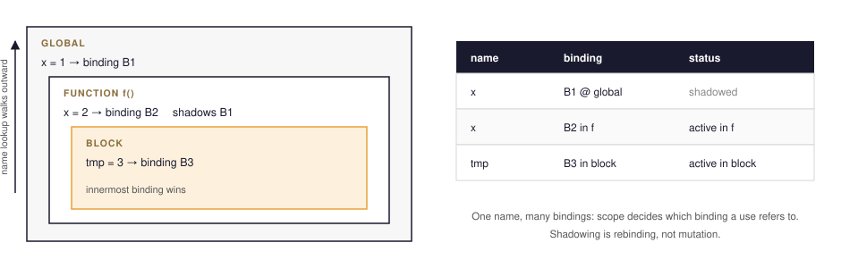
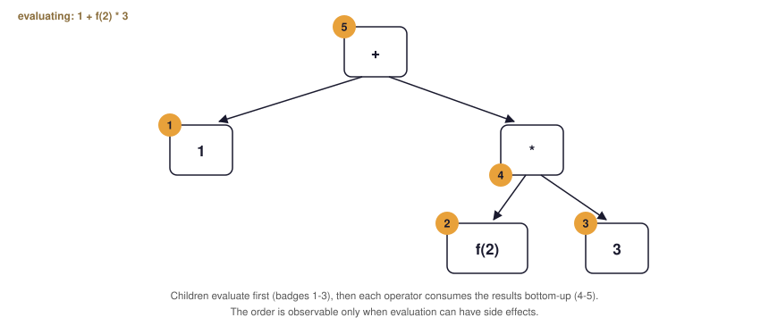
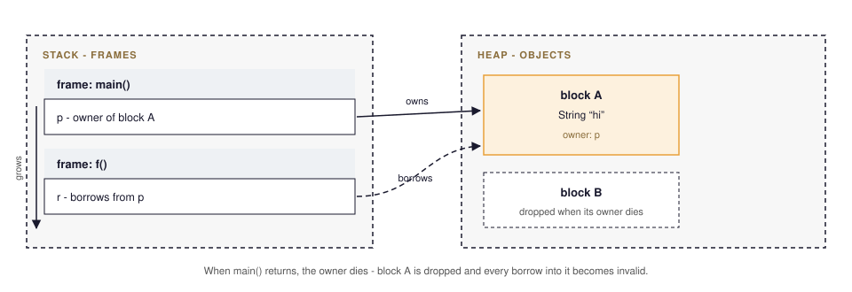
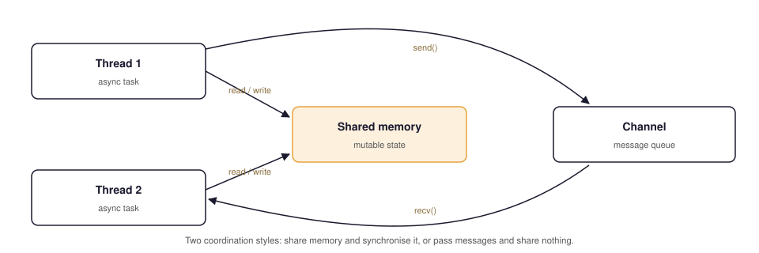
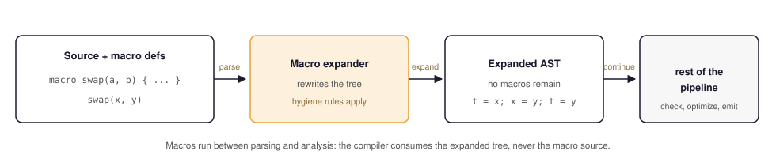
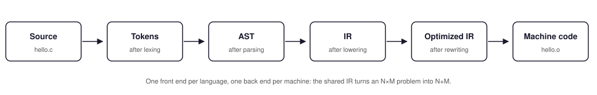

# The QLang Framework

A good question should satisfy most of these:

- It makes sense before knowing the language's solution.
- It applies to radically different kinds of languages.
- The answer can be "the language does not provide this" without making the question meaningless.
- One question reveals multiple related mechanisms.
- The answer exposes design decisions and tradeoffs.
- The answer can be investigated experimentally.
- The answer connects to other questions.


Avoid questions that already assume a particular mechanism.


**Bad:**

- ✗ Does the language have classes?
- ✗ Does it have garbage collection?
- ✗ Does it have ownership?
- ✗ Does it have async/await?
- ✗ Is it statically typed?

**Better:**


- ✓ How are abstractions represented?
- ✓ How is the lifetime of a thing managed?
- ✓ How do multiple computations coexist?
- ✓ What does the language know before execution?

<!-- end:preamble -->

---

## I. INTENT

### Why does this language exist?

What we're asking:

> Why was this language created, and what does its design care about?

In simpler words:

> What problem was this language built to solve, and what did it give up to solve it?

Questions:

- What problem was it created to solve?
- What existed before it?
- What was considered insufficient?
- What does it prioritize?
- What does it sacrifice?
- Who is it designed for?
- What kinds of programs does it make natural?
- What kinds of programs does it make difficult?
- What languages or ideas influenced it?

Covered topics:

```text
history
design goals
design philosophy
influences
target users
target domains
tradeoffs
language evolution
```

<details>
<summary><strong>history</strong></summary>

Every language is an answer to what came before it. Its history records the problems early users hit, the experiments that failed, and the compromises that endured. That timeline explains why the language looks the way it does, not merely what it contains. C grew from systems work on minicomputers; Rust grew from frustration with memory-safety bugs in browser code.

</details>

<details>
<summary><strong>design goals</strong></summary>

Design goals state what the language is explicitly optimized for: speed, safety, expressiveness, concurrency, or approachability. A language cannot maximize all of them, so the goals decide which requests get rejected during design. They also set the criteria by which later features are judged. Go's goals favored simple, fast compilation over expressive type-system features.

</details>

<details>
<summary><strong>design philosophy</strong></summary>

Design philosophy is the reasoning behind the goals: convictions about what makes code good and what a programmer should be trusted with. It guides small decisions that never appear in a specification, such as whether to offer one obvious way to do a thing. Lisp embraces minimalism and programmer power; Python favors readability and explicitness.

</details>

<details>
<summary><strong>influences</strong></summary>

Influences are the prior languages and ideas a design borrowed from, and they predict where the language will feel familiar. Knowing that a language descends from ALGOL, Lisp, or ML tells you its syntax, evaluation model, and core abstractions before you read a line of it. Rust mixes ML's type system with C's systems orientation.

</details>

<details>
<summary><strong>target users</strong></summary>

Target users define who the language assumes is writing the code: application programmers, systems engineers, data analysts, or academics. That assumption determines how much complexity the language may hide and how steep its learning curve may be. A language built for experts can expose sharp edges that a general-purpose language must round off.

</details>

<details>
<summary><strong>target domains</strong></summary>

Target domains are the kinds of programs the language aims to make natural, such as web services, numerical computing, or embedded firmware. Domain choice drives library priorities, runtime design, and what counts as a fair benchmark. A language tuned for concurrent servers may be a poor fit for tight loops on bare metal, and vice versa.

</details>

<details>
<summary><strong>tradeoffs</strong></summary>

Every design decision spends one resource to gain another: safety costs runtime checks, flexibility costs analyzability, simplicity costs features. Naming the tradeoffs keeps a language honest, because a choice with no cost is usually a choice whose cost is hidden. Static typing trades write-time freedom for errors caught before execution.

</details>

<details>
<summary><strong>language evolution</strong></summary>

Language evolution covers how a language changes after release: versioning policy, backward compatibility, and how new features get admitted. It forces a choice between freezing the standard and continuously absorbing ideas from practice. Strict compatibility lets old code run forever but accumulates baggage; aggressive change keeps the language current but fragments its ecosystem.

</details>


<!-- end:intent -->

---

## II. MEANING

### What can a program represent?

What we're asking:

> What kinds of things can I create, describe, and manipulate in this language?

In simpler words:

> What kinds of data and values exist?


Questions:

- What kinds of things can programs represent?
- What are the fundamental values?
- How are values combined?
- How are new kinds of values created?
- Can values represent alternatives?
- Can they represent absence?
- Can they represent relationships?
- What can the language express as data?
- What cannot be expressed naturally?

Covered topics:

```text
primitive types
compound types
arrays
tuples
records
structs
classes
enums
unions
sum types
product types
option/maybe
functions as values
generics
dependent types
refinement types
```

<details>
<summary><strong>primitive types</strong></summary>

Primitive types are the values the language treats as irreducible: integers, floats, characters, booleans, sometimes pointers. They define the raw vocabulary every other value is built from and fix the representation and arithmetic the machine performs. The choice forces a decision about precision and overflow: fixed-width integers wrap or trap, big integers never overflow but cost more.

</details>

<details>
<summary><strong>compound types</strong></summary>

Compound types combine several values into one so they can be created, passed, and returned together. They force a decision about layout and identity: whether the combination is copied by value or shared by reference, and whether its components are known statically. Any language that outgrows scalars needs some way to bundle data.

</details>

<details>
<summary><strong>arrays</strong></summary>

An array is a fixed sequence of elements of one type, addressed by position. It forces decisions about contiguity, bounds, and resizing: C arrays decay to raw pointers with no bounds check, while Java arrays know their length and throw on out-of-range access. The tradeoff is between predictable memory layout and safety.

</details>

<details>
<summary><strong>tuples</strong></summary>

A tuple groups a small, fixed number of values, usually of different types, without naming them. It is the cheapest way to return several results or pair two values, and it forces a choice about whether components are accessed only by position or carry structural meaning. Python and Go both lean on tuples for multiple returns.

</details>

<details>
<summary><strong>records</strong></summary>

A record is a set of named fields collected into a single value. Naming the fields is what distinguishes it from a tuple: it trades a little overhead for code that reads `point.x` instead of `point.0`. Records appear in SQL rows, Pascal, and Haskell alike because named structure survives refactoring.

</details>

<details>
<summary><strong>structs</strong></summary>

A struct is a record whose fields may carry layout guarantees, often stored contiguously in memory. It forces a decision about whether the type is just data or also behavior, and how much control the programmer has over offsets and padding. C structs expose exact layout; Go structs hide it behind rules the compiler enforces.

</details>

<details>
<summary><strong>classes</strong></summary>

A class bundles data with the operations defined over it and, usually, a rule for creating instances. It forces a decision about identity, encapsulation, and whether one class may be defined in terms of another. Languages disagree sharply here: Java makes classes the unit of reuse, while Python treats them chiefly as namespaces of methods.

</details>

<details>
<summary><strong>enums</strong></summary>

An enum names a finite set of alternatives, so a value is exactly one of a known list. It forces the question of what happens when a value falls outside the list, and whether the compiler can prove it never does. Old-style C enums are integers with labels; modern enums may carry payload.

</details>

<details>
<summary><strong>unions</strong></summary>

A union stores values of different types in the same memory, so exactly one interpretation is valid at a time. It forces the programmer or the compiler to track which alternative is live, because reading the wrong one yields garbage or undefined behavior. C unions are unchecked; tagged unions pair the storage with a discriminant.

</details>

<details>
<summary><strong>sum types</strong></summary>

A sum type is the type of values drawn from a finite set of alternatives, one at a time. It forces exhaustive handling: if every case must be matched, the compiler can catch the ones you forgot. Rust and Haskell make sum types central, so adding a variant to an enum surfaces as a compile error.

</details>

<details>
<summary><strong>product types</strong></summary>

A product type is a tuple or record type whose values must supply every component at once. The name comes from counting: its inhabitants multiply the counts of its fields, where a sum adds them. Pairing products and sums gives a language a complete vocabulary for structured data without inventing new keywords.

</details>

<details>
<summary><strong>option/maybe</strong></summary>

An option type represents "a value or nothing" explicitly, replacing an unmarked absence that can be dereferenced by mistake. It forces the caller to acknowledge the empty case, usually through pattern matching or chaining. Haskell's `Maybe` and Rust's `Option` turn null-pointer errors into ordinary code paths the compiler checks.

</details>

<details>
<summary><strong>functions as values</strong></summary>

Treating functions as values means behavior can be stored in variables, passed as arguments, and returned from other functions. It forces a decision about representation: closures carry captured data, while plain function pointers carry only an address. The payoff is generic algorithms that accept behavior, which is the basis of callbacks and pipelines.

</details>

<details>
<summary><strong>generics</strong></summary>

Generics let one definition work over many types, with the concrete type chosen at the use site. They force a tradeoff between code reuse and type-system complexity, and raise the question of whether one implementation is shared or duplicated per type. C++ templates instantiate eagerly; Java's generics erase type arguments at runtime.

</details>

<details>
<summary><strong>dependent types</strong></summary>

Dependent types are types that depend on values, so a length or an index can appear in the type itself. They push checking toward proof: a function accepting a vector of length `n` cannot be called with any other length. The cost is a much harder type checker and more annotation from the programmer.

</details>

<details>
<summary><strong>refinement types</strong></summary>

Refinement types restrict an existing type with a logical predicate, such as an even integer or an index less than the length. They force a decision about how the predicate is discharged: by a solver, by SMT checking, or by the programmer. They reach further than plain types but stop short of a full proof system.

</details>


### What does source code mean?

What we're asking:

> When I write a piece of code, what does the language say that code means?

In simpler words:

> How does written code acquire meaning?

Questions:

- What constructs does the language recognize?
- How is syntax mapped to meaning?
- What is the semantic model?
- What does an expression mean?
- What is a statement?
- What does a declaration mean?
- What does a program mean?
- Is meaning defined by evaluation, transformation, proof, relation, effects, or something else?

Covered topics:

```text
syntax
grammar
expressions
statements
declarations
semantics
evaluation
denotational semantics
operational semantics
reduction
elaboration
```

<details>
<summary><strong>syntax</strong></summary>

Syntax is the concrete shape of programs: the tokens and arrangements the language accepts. It forces decisions about how much the surface form may hint at meaning, and how much must be left to later analysis. A language with rich syntax can read like mathematics; a language with minimal syntax parses faster but leans on conventions.

</details>

<details>
<summary><strong>grammar</strong></summary>

A grammar is the formal rule set that defines which token sequences are well-formed, usually given as a context-free grammar or a set of parser combinators. It forces a choice of parsing strategy, because ambiguous grammars require conflict resolution and precedence rules. The grammar is the contract between source text and every later phase of the compiler.

</details>

<details>
<summary><strong>expressions</strong></summary>

An expression is code that computes a value, and the language must say what value each form produces. Making everything an expression, as in Lisp or Rust, lets conditionals and loops be reused in context; reserving some forms as non-values simplifies the language but limits composition. The boundary between the two shapes most syntax design.

</details>

<details>
<summary><strong>statements</strong></summary>

A statement is an instruction that performs an action rather than producing a value, such as an assignment or a jump. Separating statements from expressions keeps sequencing explicit but prevents nesting an action where a value is expected. Languages like C maintain that split; languages like Scala largely do not.

</details>

<details>
<summary><strong>declarations</strong></summary>

A declaration introduces a name and attaches it to a definition before any use of that name is allowed. It forces a decision about order and visibility: must something be declared first, and may a declaration appear inside a block? Declarations are also where a language records types, mutability, and linkage for later checking.

</details>

<details>
<summary><strong>semantics</strong></summary>

Semantics assigns meaning to well-formed programs: what a program does once the grammar has accepted it. It forces the fundamental choice of what meaning is — a computation, a mathematical object, a proof, or a relation between states. Without semantics, questions about correctness or equivalence have no answer, only opinions.

</details>

<details>
<summary><strong>evaluation</strong></summary>

Evaluation is the process of reducing expressions to values by applying the language's rules step by step. It forces decisions about when work happens, in what order, and what side effects accompany it. Whether evaluation is strict or lazy, left-to-right or unspecified, determines observable behavior in almost every nontrivial program.

</details>

<details>
<summary><strong>denotational semantics</strong></summary>

Denotational semantics maps each program construct to a mathematical function over some domain, so the meaning of a program is the composition of those functions. It forces a compositional explanation: the meaning of a whole is built from the meanings of its parts. It is elegant for pure calculation but grows strained once effects enter.

</details>

<details>
<summary><strong>operational semantics</strong></summary>

Operational semantics defines meaning by describing the steps a machine takes: states, transitions, and rules for what happens next. It forces precision about control and effects, since every observable action must appear in the step relation. Small-step and big-step variants differ in whether intermediate states are modeled explicitly.

</details>

<details>
<summary><strong>reduction</strong></summary>

Reduction is evaluation viewed as rewriting: an expression is replaced by a simpler equivalent one until no rule applies. It forces the question of whether the rewrite rules are confluent and terminating, which is exactly the property that gives functional languages a tractable notion of equality. Beta-reduction in the lambda calculus is the canonical example.

</details>

<details>
<summary><strong>elaboration</strong></summary>

Elaboration translates surface syntax into a smaller core language, resolving sugar, type annotations, and implicit arguments along the way. It forces a decision about where meaning is fixed, because much of what looks like runtime behavior is settled during elaboration. Coq and Scala both lean on it heavily.

</details>


### What does a name refer to?

What we're asking:

> When I give something a name, what exactly does that name stand for?

In simpler words:

> How does a name connect to something in the program?



Questions:

- What can be named?
- What does a name denote?
- How are bindings created?
- Where is a name visible?
- How are names resolved?
- Can two names refer to the same thing?
- Can names be rebound?
- Can names be captured?
- What happens when scopes overlap?
- Are there multiple namespaces?

Covered topics:

```text
names
bindings
scope
lexical scope
dynamic scope
environments
shadowing
closures
references
aliasing
namespaces
symbol resolution
```

<details>
<summary><strong>names</strong></summary>

A name is a programmer-chosen handle for a thing in the program, and its only job is to denote that thing reliably. Names force the question of what may be named: values, types, modules, labels, or nothing at all. The alternative, positional or numeric references, scales poorly and defeats refactoring.

</details>

<details>
<summary><strong>bindings</strong></summary>

A binding connects a name to the entity it denotes, created by a declaration or an assignment. It forces a decision about identity and mutability: may a binding be reassigned, and does the name then denote the new entity? The strength of a binding — whether it can be captured or escaped — determines much of a language's safety story.

</details>

<details>
<summary><strong>scope</strong></summary>

Scope determines where a binding is visible after it is created. It forces a choice between textual structure and dynamic history as the rule for visibility, and it bounds how local a change can be made without rippling outward. A well-designed scope rule lets unrelated components reuse the same names without collision.

</details>

<details>
<summary><strong>lexical scope</strong></summary>

Lexical scope resolves a name by its position in the source text: the enclosing block decides what a name means, regardless of who calls the function. It makes programs readable statically, because a reader can find every definition without running anything. Most modern languages, from C to Rust, use it by default.

</details>

<details>
<summary><strong>dynamic scope</strong></summary>

Dynamic scope resolves a name from the caller's active bindings at runtime, so an inner function sees whatever its caller happens to have defined. It forces a tradeoff: great flexibility for passing context, but meaning that changes with call sites. Bash and early Lisp dialects used it; almost nothing does so now.

</details>

<details>
<summary><strong>environments</strong></summary>

An environment is the mapping from names to entities that is in effect at some point of execution. It forces a representation decision: environments may be persistent structures shared across calls, or mutable frames pushed and popped on a stack. Understanding environments explains closures, recursion, and how a REPL remembers earlier definitions.

</details>

<details>
<summary><strong>shadowing</strong></summary>

Shadowing occurs when a new binding hides an outer one of the same name within a narrower scope. It forces a question of permission and clarity: is hiding allowed, warned about, or an error? Shadowing lets a programmer reuse a short name locally, but it can also make a reader track the wrong definition.

</details>

<details>
<summary><strong>closures</strong></summary>

A closure is a function bundled with the environment it captured, so the function still sees its original names after the defining scope has ended. It forces a decision about how captured values are stored: copied, referenced, or owned, with matching lifetime rules. Closures make callbacks and iterators practical in nearly every modern language.

</details>

<details>
<summary><strong>references</strong></summary>

A reference is a name that denotes an existing object rather than a copy of it, so a change through one is visible to the others. It forces questions of lifetime and permission: how long may the reference live, and who else may write through it at the same time? Rust's `&mut` encodes exclusive access in the type.

</details>

<details>
<summary><strong>aliasing</strong></summary>

Aliasing happens when two or more names denote the same object at the same time. It forces a tradeoff between convenience and reasoning: aliases make shared updates easy but make local analysis unreliable, since a write through one name invalidates assumptions made about another. Languages that restrict aliasing can optimize far more aggressively.

</details>

<details>
<summary><strong>namespaces</strong></summary>

A namespace is a named region that groups identifiers so identical names in different groups do not collide. It forces a decision about how names are qualified and how a short name is expanded into a full one. Python modules, Java packages, and C++ namespaces each solve the same problem with different syntax.

</details>

<details>
<summary><strong>symbol resolution</strong></summary>

Symbol resolution is the process of matching each identifier in the source to the binding it denotes. It forces questions about overload sets, ambiguity, and order: which of several candidates wins, and when is a program rejected as unresolvable? Any feature that adds overloading or ad-hoc polymorphism makes this step harder.

</details>


<!-- end:meaning -->

## III. COMPUTATION

### How does computation proceed?

What we're asking:

> Once a program starts running, what determines what happens next?

In simpler words:

> How does the program move from one computation to another?



Questions:

- What causes computation to happen?
- What determines the next step?
- In what order are things evaluated?
- Can evaluation be delayed?
- Can evaluation branch?
- Can evaluation backtrack?
- Can computation be recursive?
- Can computation be suspended and resumed?
- Is computation driven by control flow, rewriting, reduction, search, data dependencies, or something else?

Covered topics:

```text
evaluation order
control flow
conditionals
loops
recursion
pattern matching
lazy evaluation
eager evaluation
backtracking
generators
coroutines
continuations
```

<details>
<summary><strong>evaluation order</strong></summary>

Evaluation order fixes which subexpression is reduced first when several appear in one construct. It forces a stark choice: specify an order for predictability, or leave it unspecified so compilers stay free to rearrange. The difference is observable whenever operands have side effects, as C leaves order largely open while Python fixes it left to right.

</details>

<details>
<summary><strong>control flow</strong></summary>

Control flow is the set of rules that decides which statement executes next. It forces a design decision about how much the programmer may direct execution: unconditional jumps, structured constructs, or only the shape of data flow. Restricting control flow aids analysis; exposing it, as with `goto`, permits patterns no structured form covers.

</details>

<details>
<summary><strong>conditionals</strong></summary>

A conditional chooses between branches based on a test, which is what makes computation non-linear. It forces the language to define what counts as a truth value and whether both branches must produce compatible results. Making conditionals expressions, as in Lisp's `cond` or Rust's `if let`, lets a choice feed directly into further computation.

</details>

<details>
<summary><strong>loops</strong></summary>

A loop repeats a body until a condition fails or a sequence is exhausted. It forces decisions about iteration state, exit conditions, and whether the language offers one looping construct or several. Too many loop forms fragment style; too few force awkward encodings of early exit and nesting.

</details>

<details>
<summary><strong>recursion</strong></summary>

Recursion is self-reference: a function calls itself to break a problem into smaller cases. It forces the question of how stack space is managed, since naive recursion consumes a frame per call. Tail-call optimization, as in Scheme, turns some recursion into iteration; strict-stack languages like Java require rewriting it instead.

</details>

<details>
<summary><strong>pattern matching</strong></summary>

Pattern matching deconstructs a value by shape and tests its components in a single construct, replacing chains of type tests and field accesses. It forces a requirement of exhaustiveness: whether the compiler must prove every case is covered. It is the natural companion of sum types and is central to ML-family languages.

</details>

<details>
<summary><strong>lazy evaluation</strong></summary>

Lazy evaluation delays computing a value until it is actually needed, and may never compute it at all. It forces tradeoffs about predictability: it enables infinite structures and avoids wasted work, but makes cost and side effects harder to reason about. Haskell evaluates by need; most other languages do not.

</details>

<details>
<summary><strong>eager evaluation</strong></summary>

Eager evaluation computes each value as soon as it is required, which makes the timing of work and effects straightforward. It forces the cost of possibly unused computation and of data structures that are never read. Imperative languages default to it, accepting wasted work in exchange for simple, predictable behavior.

</details>

<details>
<summary><strong>backtracking</strong></summary>

Backtracking abandons a partial choice and retries an alternative when the current path fails to produce a result. It forces the language to represent alternatives and to decide how state is undone on retreat. Prolog makes backtracking the execution model; ordinary languages expose it only through explicit search loops or exceptions.

</details>

<details>
<summary><strong>generators</strong></summary>

A generator is a function that produces a sequence of values across successive resumptions instead of returning one result. It forces a decision about how state is suspended and where the values live: in a hidden frame, or in a compiler-transformed state machine. Python's `yield` and Rust's iterators both turn sequences into composable producers.

</details>

<details>
<summary><strong>coroutines</strong></summary>

A coroutine is a computation that can voluntarily suspend itself and later resume where it left off, cooperatively sharing the thread. It forces questions about who controls resumption and what state survives the yield. Kotlin's `suspend` functions and Go's goroutine-style coroutines differ mainly in how much of that the runtime hides.

</details>

<details>
<summary><strong>continuations</strong></summary>

A continuation represents "the rest of the computation" as a first-class value that can be stored, called, or discarded. It forces the deepest control-flow question: whether arbitrary jumps and resumptions are expressible, and at what runtime cost. Call/cc in Scheme captures it directly; most languages approximate it with callbacks or exceptions.

</details>


### How is behavior defined and composed?

What we're asking:

> How do I define reusable behavior, and how do I combine pieces of behavior?

In simpler words:

> How do I make something happen and reuse that behavior elsewhere?

Questions:

- How do I define reusable behavior?
- What is a function?
- Is behavior a value?
- Can behavior be passed around?
- Can behavior be returned?
- Can behavior capture context?
- How is behavior combined with other behavior?
- What are the basic units of composition?

Covered topics:

```text
functions
procedures
methods
closures
lambdas
function pointers
higher-order functions
callbacks
objects
predicates
relations
composition
```

<details>
<summary><strong>functions</strong></summary>

A function is a named, reusable unit of behavior with parameters and a result. It forces decisions about how arguments are passed, whether several results may be returned, and whether the function is a value in its own right. Treating functions as first-class values, as Lisp does, unlocks the whole design of higher-order programming.

</details>

<details>
<summary><strong>procedures</strong></summary>

A procedure is a subroutine that performs actions but returns no meaningful value, emphasizing effect over computation. It forces a distinction between doing and computing, which shapes how a language reasons about side effects and testing. Early ALGOL-family languages separated the two; many modern languages blur them by allowing any call in statement position.

</details>

<details>
<summary><strong>methods</strong></summary>

A method is a function associated with a type and invoked through an instance or a receiver. It forces a choice of dispatch: whether the implementation is chosen statically from the receiver's declared type or dynamically at runtime. That single choice separates value-oriented designs from object-oriented ones with inheritance and overriding.

</details>

<details>
<summary><strong>closures</strong></summary>

A closure is a function together with the variables it captured from its defining scope. It forces a decision about how those variables are stored and how long they live: captured by value, by reference, or by ownership with defined lifetimes. Closures let functions carry context, which is what makes callbacks and pipelines practical.

</details>

<details>
<summary><strong>lambdas</strong></summary>

A lambda is an anonymous function written inline at the point of use. It forces a tradeoff between brevity and discoverability: the body sits exactly where it is needed, but there is no name to reference or document separately. Lambdas in Python and Java make short transformations readable without declaring a whole function.

</details>

<details>
<summary><strong>function pointers</strong></summary>

A function pointer is a raw address of code that can be stored and called indirectly. It forces a minimal view of behavior: one machine address, no captured data, and no type beyond a signature. C's `qsort` takes a comparison function pointer, which is the cheapest possible form of pluggable behavior.

</details>

<details>
<summary><strong>higher-order functions</strong></summary>

A higher-order function takes functions as arguments or returns a function as its result. It forces the design of function types and of the calling convention for them, because the language must treat code as data. `map`, `filter`, and `fold` are higher-order functions that let programs be written as transformations over collections.

</details>

<details>
<summary><strong>callbacks</strong></summary>

A callback is a function handed to another so it can be invoked later, typically when an event occurs or an operation completes. It forces decisions about who owns the callback's context and how errors propagate back through it. Node.js built its I/O model on callbacks, and their nesting problems motivated promises and async syntax.

</details>

<details>
<summary><strong>objects</strong></summary>

An object is a runtime entity that combines state with behavior and is identified by reference rather than by its contents. It forces questions of identity, mutation, and sharing: two objects may be equal yet distinct, and a mutation through one observer is visible to the others. Objects model rich stateful systems naturally but complicate reasoning about aliasing.

</details>

<details>
<summary><strong>predicates</strong></summary>

A predicate is a function that returns a truth value, used to test or to filter. It forces the question of whether truth is a distinct type or an ordinary boolean, and how predicates combine under conjunction and negation. Predicates are the working vocabulary of list comprehensions, SQL `WHERE` clauses, and generic search routines.

</details>

<details>
<summary><strong>relations</strong></summary>

A relation specifies which tuples of values stand in a stated connection, rather than computing one direction from another. It forces a shift from computation to declaration: state what holds, and let the system find instances. SQL queries and Prolog clauses are relational, and they can run in directions no function can.

</details>

<details>
<summary><strong>composition</strong></summary>

Composition combines smaller pieces of behavior into larger ones, typically by chaining functions or nesting effects. It forces a decision about the basic unit of composition and whether the result is still a value of the same kind. Function composition, as in Haskell, builds programs as pipelines; object composition builds them by containment.

</details>


### How are abstractions formed?

What we're asking:

> How do I take an idea and turn it into something reusable, general, and composable?

In simpler words:

> How do I avoid repeating ideas and control what other parts of the program can see?

Questions:

- How do I avoid repeating an idea?
- How can an idea be generalized?
- What can be parameterized?
- What can be hidden?
- What can be exposed?
- What can depend on another abstraction?
- How can abstractions be composed?
- At what level can abstraction happen?

Covered topics:

```text
functions
modules
classes
interfaces
traits
generics
templates
typeclasses
macros
abstract data types
encapsulation
information hiding
metaprogramming
```

<details>
<summary><strong>functions</strong></summary>

Functions are the first and most universal unit of abstraction: name a computation, parameterize it, call it anywhere. They force the question of whether a function is merely callable or also a value that can be stored and passed. Languages that answer yes gain reusable algorithms; those that answer no keep a simpler execution model.

</details>

<details>
<summary><strong>modules</strong></summary>

A module groups related definitions behind an explicit boundary, exporting some names and hiding the rest. It forces decisions about file correspondence, cyclic imports, and whether compilation is per-module or whole-program. Modules are the primary unit of code organization in Go, Python, and Rust, each with a different rule about what is visible by default.

</details>

<details>
<summary><strong>classes</strong></summary>

A class defines a family of objects sharing structure and behavior, and it is the classical vehicle for reuse by inheritance. It forces choices about what a subclass inherits, how a base implementation may be overridden, and what happens when a method is called on a partially initialized object. Not every language needs them to build abstractions.

</details>

<details>
<summary><strong>interfaces</strong></summary>

An interface specifies what operations a type must support, without saying how they are implemented. It forces a decision about who checks conformance: the type author declaring it, as in Go, or the compiler verifying structural fit, as in Rust. Interfaces let unrelated types be used interchangeably wherever the contract holds.

</details>

<details>
<summary><strong>traits</strong></summary>

A trait is a bundle of behavior that a type can implement, usually composed without a class hierarchy. It forces the problem of conflicts: when two traits supply the same method, the language must define how a winner is chosen. Traits give reuse across unrelated types while avoiding the fragile base-class problems of inheritance.

</details>

<details>
<summary><strong>generics</strong></summary>

Generics let one abstraction be written once and used at many types. They force a tradeoff between eliminating repetitive code and increasing the complexity of the type checker, plus a decision about how instances are compiled: shared once or duplicated per type. Rust and C++ monomorphize; Java erases and compensates with casts.

</details>

<details>
<summary><strong>templates</strong></summary>

A template is a parameterized definition expanded at compile time, often by full instantiation of its body. It forces a choice between checking the template body once and checking each instantiation separately, because an error may appear only at a use site. C++ templates are powerful precisely because they are unchecked until expanded.

</details>

<details>
<summary><strong>typeclasses</strong></summary>

A typeclass declares that types meeting a certain interface belong to a named category of behavior. They force a question of coherence: given a type and an operation there should be exactly one implementation in scope, or the program is ambiguous. Haskell's typeclasses enable ad-hoc polymorphism without a shared base class.

</details>

<details>
<summary><strong>macros</strong></summary>

A macro transforms or generates code before ordinary compilation, operating on syntax rather than on values. It forces a decision about what stage the language is running at and how much of the program a macro may inspect or rewrite. Lisp macros manipulate the language's own forms; Rust's macros use token trees with hygiene rules.

</details>

<details>
<summary><strong>abstract data types</strong></summary>

An abstract data type defines a type solely by its operations, hiding the representation entirely. It forces the discipline that only those operations may construct or inspect values, which makes invariants enforceable rather than merely documented. A stack defined this way cannot be misused, because clients never see the underlying array.

</details>

<details>
<summary><strong>encapsulation</strong></summary>

Encapsulation groups state and the operations over it so they can be changed together. It forces a boundary decision: what is inside the bundle, what is exposed, and who may cross that line. It is weaker than information hiding, since a language may package things together while still letting external code reach in.

</details>

<details>
<summary><strong>information hiding</strong></summary>

Information hiding deliberately keeps a design decision — representation, algorithm, resource — invisible to clients so it can change without breaking them. It forces the contrast with mere encapsulation: a module may expose its fields and still hide its strategy. Parnas argued that hiding decisions, not data, is what reduces coupling.

</details>

<details>
<summary><strong>metaprogramming</strong></summary>

Metaprogramming is writing code that writes, inspects, or manipulates other code. It forces a choice of stage and of power: whether generated code can be checked before it runs, and how much of the language the generator itself can see. Reflection, code generation, and compile-time evaluation are all forms of it.

</details>


<!-- end:computation -->

## IV. TIME, STATE, AND RESOURCES

### What can change?

What we're asking:

> What can change during execution, and who is allowed to change it?

In simpler words:

> How does the language deal with state and mutation?

Questions:

- What is mutable?
- What is immutable?
- What is state?
- Where does state live?
- Who may change it?
- Who observes the change?
- Can change be isolated?
- Can the compiler reason about change?
- What happens when multiple computations change the same thing?

Covered topics:

```text
state
mutation
immutability
assignment
mutable variables
mutable objects
aliasing
references
shared state
isolation
persistent data
```

<details>
<summary><strong>state</strong></summary>

State is the collection of values a program can observe at a given moment during execution. A language must decide what counts as state, where it lives, and which parts of a computation are allowed to read or change it. Unrestricted state makes reasoning hard, so most languages constrain it through scope, ownership, or effects. The tradeoff is between the convenience of updating data in place and the ability to reason locally about code.

</details>

<details>
<summary><strong>mutation</strong></summary>

Mutation is the act of replacing a value, or part of a value, after it has been created. Languages need it because many programs are accumulators, simulators, and controllers that must update data as events arrive. The design choice is how much mutation to allow and where: unrestricted assignment simplifies imperative code but complicates aliasing analysis and concurrency. Some languages confine mutation to narrow scopes or require it to be declared explicitly.

</details>

<details>
<summary><strong>immutability</strong></summary>

Immutability means a binding or value cannot change after construction, so every operation returns a new value instead of altering an old one. It buys simple reasoning: an immutable value behaves the same whenever it is observed, which helps in parallel execution and in caching. The cost is allocation and rebuilding, since updates must copy structure. Languages differ in degree — some make everything immutable by default, others allow mutation but track it in the type system.

</details>

<details>
<summary><strong>assignment</strong></summary>

Assignment writes a new value into an existing storage location, so a name or field becomes bound to something different than before. It is the most basic form of mutation, and languages must specify its scope: whether it rebinds a local name, overwrites memory, or mutates an object shared through references. Distinguishing rebinding from in-place mutation matters, because a name that points elsewhere leaves the original object untouched. The design question is whether assignment is pervasive or restricted to explicitly mutable slots.

</details>

<details>
<summary><strong>mutable variables</strong></summary>

A mutable variable is a storage location whose value may be reassigned after initialization. Languages need a way to express changing values — loop counters, accumulators, current state — so most provide some form of mutable binding, though some make bindings immutable by default and require a keyword like `var` or `mut` to opt in. Requiring an explicit marker documents intent and lets readers tell constant from changing data. The tradeoff is verbosity against clarity about where change can happen.

</details>

<details>
<summary><strong>mutable objects</strong></summary>

A mutable object can have its fields or contents modified without replacing the object itself. This lets many names share one changing entity cheaply, which suits caches, graphs, and interface models. The cost is that any observer may see the object change between two reads, so reasoning about a function requires knowing what it may mutate. Languages respond by exposing mutability in types, restricting it to certain objects, or offering copy-on-write alternatives.

</details>

<details>
<summary><strong>aliasing</strong></summary>

Aliasing occurs when two or more names or references designate the same underlying object. It is an unavoidable consequence of mutable references, and it makes local reasoning harder: writing through one name silently changes what another name reads. Languages must therefore decide whether to permit unrestricted aliasing, track it through ownership or uniqueness types, or forbid mutation of aliased data altogether. The tradeoff is expressive sharing against the difficulty of proving that an update is safe.

</details>

<details>
<summary><strong>references</strong></summary>

A reference is a handle that designates a value or object without copying it. References let functions and data structures share and traverse complex values efficiently, but they also introduce indirection, aliasing, and the possibility of referring to something that no longer exists. A language must decide what a reference guarantees: lifetime validity, permission to mutate, or only address stability. Choices range from raw addresses in C to checked, uniquely owned references in Rust.

</details>

<details>
<summary><strong>shared state</strong></summary>

Shared state is data that more than one computation can read or write at the same time. It is essential for communication between threads, processes, and separately running components, but it is also the main source of race conditions and order-dependent bugs. Languages must choose how sharing is established and controlled: by default with locks, by making sharing explicit in types, or by avoiding shared mutable state through message passing. The tradeoff is performance and convenience against the difficulty of reasoning about concurrent updates.

</details>

<details>
<summary><strong>isolation</strong></summary>

Isolation confines state so that a computation cannot observe or affect anything outside a defined boundary. It underpins modularity, sandboxing, and parallelism: work that provably touches no shared data can run without synchronization. Languages achieve isolation through value semantics, ownership, capabilities, separate heaps, or process boundaries, and each level offers a different balance of safety and friction. The design question is how much isolation to impose by default and how expensive it is to cross the boundary deliberately.

</details>

<details>
<summary><strong>persistent data</strong></summary>

Persistent data structures retain their previous versions when updated, so an old reference still observes the state it captured. They make undo, history, branching computation, and safe sharing practical without copying entire structures, typically by sharing unchanged substructure between versions. The tradeoff is higher per-update cost and more allocation against the elimination of destructive aliasing surprises. Languages that rely on them range from Haskell and Clojure to standard libraries that ship immutable collections.

</details>


### What is the lifetime of a thing?

What we're asking:

> When something is created, how long does it exist, and who controls when it stops existing?

In simpler words:

> Who is responsible for the existence of a thing?



Questions:

- When is something created?
- Where does it live?
- Who is responsible for it?
- Who can access it?
- When does it stop existing?
- Can its lifetime be extended?
- Can multiple things refer to it?
- What happens when it becomes invalid?
- Who releases its resources?

Covered topics:

```text
stack
heap
allocation
deallocation
pointers
references
ownership
borrowing
lifetimes
garbage collection
reference counting
move semantics
RAII
resource management
memory layout
alignment
```

<details>
<summary><strong>stack</strong></summary>

The stack is the region of storage that holds function frames: arguments, locals, and return addresses, allocated and released in last-in-first-out order as calls nest. It is extremely cheap because a frame's lifetime is tied exactly to its call and requires no bookkeeping. The constraint is that stack objects cannot outlive the frame that created them, so anything with a longer or dynamic lifetime must live elsewhere. Language designs differ in whether the stack is implicit, explicit, or absent in runtimes where everything is heap allocated.

</details>

<details>
<summary><strong>heap</strong></summary>

The heap is storage whose lifetime is independent of any single call frame, so objects can be created in one place and used long after the creating function returns. It enables dynamic data structures, closures, and objects of runtime-determined size, at the cost of explicit or managed lifetime decisions. A language must say who allocates, who frees, and how a freed region is kept out of reach. Designs range from manual `malloc` and `free` to garbage-collected runtimes to ownership-based arenas.

</details>

<details>
<summary><strong>allocation</strong></summary>

Allocation is the process of reserving a region of storage and handing it to the program as usable memory or a resource. Programs allocate constantly — objects, buffers, closures, growing tables — so the strategy determines much of a runtime's performance profile. A language must decide granularity, synchronization, and whether allocation sites are visible in the source or hidden behind constructors and the collector. The tradeoff is control and predictability against convenience and safety.

</details>

<details>
<summary><strong>deallocation</strong></summary>

Deallocation returns previously allocated storage or resources to the system so they can be reused. It is the half of memory management that creates most hazards: freeing too early yields dangling references, freeing too late leaks. Languages solve it by manual calls, reference counting, tracing collection, region or ownership rules, or scope-bound cleanup. The choice trades programmer control against the risk of use-after-free and leaks.

</details>

<details>
<summary><strong>pointers</strong></summary>

A pointer is a value that stores the address of another value in memory. Pointers give direct, cheap access to arbitrary memory and are essential for linked structures, arrays, and foreign interfaces, but they also allow a program to compute addresses the runtime never validated. A language must decide how much checking to apply: none in C, bounds and provenance checks in safer designs, or pointers hidden behind references. The tradeoff is low-level expressiveness against memory safety.

</details>

<details>
<summary><strong>references</strong></summary>

A reference is a name or handle that designates an existing object rather than holding a copy of it. Compared with raw pointers, references typically promise that the referent is valid and often constrain how it may be mutated. Languages must specify aliasing rules, whether references can outlive the referent, and whether several mutable references may coexist. Those choices drive whole error models: some runtimes check them dynamically, others prove them statically, and some simply trust the programmer.

</details>

<details>
<summary><strong>ownership</strong></summary>

Ownership is a rule stating which single entity is responsible for a value and for releasing it when its life ends. Having exactly one owner gives a language a deterministic point at which cleanup occurs and eliminates ambiguity about who deallocates. Rust pairs ownership with moves on assignment so a value is never silently duplicated behind the owner's back. The tradeoff is a stricter programming discipline in exchange for memory safety without a garbage collector.

</details>

<details>
<summary><strong>borrowing</strong></summary>

Borrowing lets code use a value temporarily without taking ownership of it, typically as a reference valid only for a limited region. It solves the ergonomic problem that strict ownership would otherwise force frequent clones and moves through call boundaries. The key design question is what a borrow guarantees: in checked designs it cannot outlive its owner and cannot coexist with conflicting borrows. The tradeoff is annotation burden against freedom from dangling references.

</details>

<details>
<summary><strong>lifetimes</strong></summary>

A lifetime is the span during which a value or reference is valid, from creation to the point where its storage is released. Declaring lifetimes lets a language check that no reference is used after the object it points to has died, which is the root of dangling-pointer bugs. Languages handle this implicitly through scope or collection, explicitly through lifetime annotations, or not at all by shifting the burden to the programmer. The design choice is how visible the rules are and how much they cost in notation.

</details>

<details>
<summary><strong>garbage collection</strong></summary>

Garbage collection reclaims storage for objects that are no longer reachable, deciding at runtime when it is safe to free them. It removes entire classes of deallocation bugs and simplifies cyclic data structures that ownership schemes find awkward. The costs are pause times, throughput overhead, and less predictable timing, which matters for real-time or systems work. Languages choose between tracing collectors, incremental collectors, and collectors integrated with the type system.

</details>

<details>
<summary><strong>reference counting</strong></summary>

Reference counting frees an object as soon as its last reference disappears, incrementing a counter on duplication and decrementing on discard. It offers prompt, predictable reclamation without global tracing pauses, which suits shared objects and runtimes that value immediate cleanup. Its weakness is overhead on every copy and the inability to reclaim cycles without a separate cycle detector. The design tension is between local, immediate destruction and the cost paid on every reference.

</details>

<details>
<summary><strong>move semantics</strong></summary>

Move semantics transfer a value's ownership from one binding to another instead of copying or leaving both valid. After a move the source is typically unusable, which prevents two owners from racing to free the same memory and avoids expensive copies of large data. Languages must define when moves happen implicitly, such as on assignment or when passing arguments, and what the abandoned variable still permits. The tradeoff is careful sequencing in code against cheap transfer and clear cleanup points.

</details>

<details>
<summary><strong>RAII</strong></summary>

RAII ties a resource's lifetime to the lifetime of an object: acquisition happens in construction, release in destruction. Because destructors run when a scope exits, cleanup happens on normal returns and on unwinding from errors, so files, locks, and handles are not leaked. The technique requires reliable, deterministic destruction, which rules it out for languages where object death is deferred to the collector. The design question is whether scope exit is a dependable place to run arbitrary cleanup code.

</details>

<details>
<summary><strong>resource management</strong></summary>

Resource management covers everything a program must obtain and release: memory, files, sockets, locks, timers, and hardware handles. Unlike memory, many of these cannot be reclaimed by a collector, so a language needs a discipline that guarantees release on every path, including errors and early returns. Common answers are scope-bound destructors, explicit close calls, borrowed handles, and typed capabilities that make an unclosed resource a type error. The tradeoff is ergonomic burden against the certainty that nothing is left open.

</details>

<details>
<summary><strong>memory layout</strong></summary>

Memory layout describes how a value's fields are arranged in storage: contiguously or through indirection, inline or boxed, and in what order. It determines cache locality, allocation size, and what a language can pass cheaply by value. A language must decide how much layout it exposes — transparent and stable in C, mostly abstracted in managed runtimes — because exposing it gives performance control while freezing future representation changes. The tradeoff is interoperability and speed against abstraction freedom.

</details>

<details>
<summary><strong>alignment</strong></summary>

Alignment is the requirement that a value begin at an address divisible by its size, matching how the hardware fetches words. Processors access aligned data efficiently and some architectures fault on misaligned access, so compilers and allocators pad structures to satisfy it. The tradeoff is wasted padding bytes between fields against fast, portable loads and stores. Languages either promise natural layout rules or let the implementation reorder fields, which in turn affects what external code can safely assume.

</details>


### What happens when computation does not proceed normally?

What we're asking:

> How does the language represent situations where computation does not produce its normal result?

In simpler words:

> What happens when something is missing, fails, goes wrong, or has multiple possible outcomes?

Questions:

- How is absence represented?
- How does failure happen?
- How does failure propagate?
- How are exceptional situations represented?
- Can computation have multiple possible outcomes?
- Can it backtrack?
- Can failure be recovered from?
- Can the programmer be forced to handle failure?

Covered topics:

```text
absence
Option
Maybe
Result
Either
error codes
exceptions
panic
assertions
contracts
failure propagation
backtracking
nondeterminism
```

<details>
<summary><strong>absence</strong></summary>

Absence is the state where an expected value simply is not there: a missing key, an end of input, an optional setting. A language must represent this without conflating it with a magic value such as zero or a null pointer, which programs routinely mistake for real data. Common designs attach a wrapper that forces the programmer to consider both cases before using the result. The tradeoff is a little ceremony at use sites against the elimination of an entire category of crashes.

</details>

<details>
<summary><strong>Option</strong></summary>

Option is a type that models "either a value or nothing," normally as two cases: present or absent. It makes absence explicit in the type signature, so a caller must handle the empty case or deliberately unwrap it, and the compiler can find the places that do not. Rust uses `Option` in place of null for all potentially missing data. The cost is that ordinary lookups gain a layer of unwrapping that older designs did not require.

</details>

<details>
<summary><strong>Maybe</strong></summary>

Maybe is the same two-case "value or nothing" type as Option, familiar from Haskell and ML-family languages. Its typical operations — mapping and chaining — let a computation skip the whole pipeline when nothing is present instead of testing at each step. Presenting absence as a type rather than a sentinel keeps partial functions from silently returning junk. The design question is whether the language offers one such type, or separate types for absence, failure, and alternatives.

</details>

<details>
<summary><strong>Result</strong></summary>

Result is a type that carries either a success value or a description of what went wrong, so failure becomes data the caller must inspect. It makes error handling explicit and composable: a function returning Result propagates failure until someone decides to recover. Rust's `Result` and Haskell's `Either`-style returns are typical examples. The tradeoff is verbose handling at every call site against compiler-visible, exhaustive treatment of failure paths.

</details>

<details>
<summary><strong>Either</strong></summary>

Either is a general two-case type that holds one of two alternatives, frequently used to encode success or failure where the second case carries an error value. Because it is generic, libraries reuse it for results, validation accumulations, and parsing outcomes. Its generality is also its weakness: nothing in the name says which side means success, so conventions or dedicated wrappers are needed for clarity. The design choice is between a flexible Either and a purpose-built error type.

</details>

<details>
<summary><strong>error codes</strong></summary>

Error codes report failure by returning a special value — a negative number, a status enum, a null pointer — that the caller must check. They are cheap, portable, and usable across language boundaries, which is why operating system APIs favor them. Their weakness is that checking is optional, so unchecked results silently continue with invalid data. A language can improve on raw codes by making the status part of the type or by pairing it with assertions.

</details>

<details>
<summary><strong>exceptions</strong></summary>

Exceptions transfer control out of the normal flow to a handler when an operation cannot complete, unwinding the stack until a matching catch is found. They separate the happy path from error handling and let deep call stacks report failure without threading status values through every return. The costs are hidden control flow, harder reasoning about which calls may throw, and nonlocal cleanup obligations. Designs range from mandatory checked exceptions to unchecked ones to languages with no exceptions at all.

</details>

<details>
<summary><strong>panic</strong></summary>

Panic denotes a failure the program is not expected to recover from: a violated internal invariant, an unreachable branch, a corrupted state. It typically aborts the current task or the process, possibly after printing a diagnostic and running limited cleanup. Languages use it to draw a line between recoverable errors, which callers handle, and bugs, which they do not. The design question is whether panic unwinds safely, runs destructors, or terminates immediately.

</details>

<details>
<summary><strong>assertions</strong></summary>

An assertion is a statement that a condition must hold at a specific point, checked at runtime or by a static tool. Programmers use them to encode invariants that are assumed everywhere but verified nowhere else, turning silent corruption into an immediate, located failure. Assertions are often stripped in release builds, so they document and check intent rather than replace validation of external input. The tradeoff is runtime cost and the risk of disabling checks that would have caught real bugs.

</details>

<details>
<summary><strong>contracts</strong></summary>

Contracts specify preconditions, postconditions, and invariants that functions and types promise to satisfy. They let a programmer state what a routine assumes and guarantees, so a violation points directly to the party that broke the agreement rather than to distant symptoms. Languages support them variously through runtime checks, annotations read by a static verifier, or types that encode the same facts. The tradeoff is specification effort and possible runtime overhead against earlier, sharper failure detection.

</details>

<details>
<summary><strong>failure propagation</strong></summary>

Failure propagation is how a failed computation signals upward until some caller deals with it. The mechanism shapes the entire error surface of a language: returned error values must be forwarded manually, exceptions unwind automatically until caught, and panics typically stop the program. Some designs make propagation implicit through operator syntax or do-not-care markers, which reduces boilerplate but hides where failures are dropped. The design choice is between explicit, visible propagation and concise, implicit propagation.

</details>

<details>
<summary><strong>backtracking</strong></summary>

Backtracking is computation that abandons a partial choice and returns to an earlier point to try an alternative. It is the natural model for search, parsing, and logic programming, where the answer emerges from exploring a space of possibilities. A language must decide how to represent saved choice points and how to undo effects made after them, since side effects generally cannot be rewound. The tradeoff is expressive search against memory cost and the difficulty of reversing state changes.

</details>

<details>
<summary><strong>nondeterminism</strong></summary>

Nondeterminism means a computation may produce different, equally valid results across runs, whether from random input, concurrent scheduling, or an explicit choice operator. Languages need it to model randomness, scheduling, and search, but it makes reproducibility and testing harder because a single run does not characterize the program. Designers must decide how much nondeterminism to expose in types and whether effects such as randomness must be requested explicitly. The tradeoff is fidelity to the problem against the ability to reason about and replay executions.

</details>


<!-- end:state -->

## V. WORLD

### How does a program interact with the outside world?

What we're asking:

> How does a program affect or observe things outside its own computation?

In simpler words:

> How does the program talk to the real world?


Questions:

- How does it perform I/O?
- How does it access files?
- Networks?
- Processes?
- Hardware?
- Time?
- Randomness?
- Operating-system functionality?
- Foreign code?
- External resources?


Covered topics:

```text
I/O
files
stdin/stdout
networking
system calls
processes
environment
hardware
FFI
foreign functions
effects
effect systems
resources
```

<details>
<summary><strong>I/O</strong></summary>

Input/output is any exchange between a program and the world beyond its own memory: reading data, writing results, receiving events. It is irreducibly sequential and order-dependent, which contrasts with the deterministic computation a language can reason about locally. A language must decide whether I/O is a plain function call, an effect tracked in the type system, or an explicit value to be sequenced. The tradeoff is transparent convenience against the ability to reason, reorder, or test operations safely.

</details>

<details>
<summary><strong>files</strong></summary>

Files provide named, persistent storage that outlives a single execution and is shared with other programs. Accessing them raises the full set of resource questions: opening, buffering, partial reads and writes, permissions, concurrent writers, and closing on every exit path. Languages offer anything from thin wrappers over system calls to abstract streams and safe scope-bound handles. The design choice is how much of the underlying operating system semantics to expose versus to normalize behind a portable interface.

</details>

<details>
<summary><strong>stdin/stdout</strong></summary>

stdin/stdout are the conventional channels through which a program receives input and emits output when connected to a terminal, pipe, or another process. They make programs composable in the Unix tradition: small tools chain together, with one program's output becoming another's input. Because these streams are unidirectional, buffered, and may block, a language must decide how blocking is expressed and whether alternative streams are just values. The design question is whether standard streams are special primitives or ordinary examples of a general I/O abstraction.

</details>

<details>
<summary><strong>networking</strong></summary>

Networking lets a program communicate with remote machines over protocols such as TCP, UDP, or HTTP, where latency, partial delivery, and disconnection are normal conditions. It forces a language to handle work that may take arbitrarily long without blocking everything else, which is why networking drives support for asynchronous I/O and concurrency. Designs range from blocking calls on threads to event loops to futures and coroutines. The tradeoff is simplicity of straight-line code against scalability under many simultaneous connections.

</details>

<details>
<summary><strong>system calls</strong></summary>

System calls are the supervised entry points through which a program requests services from the operating system: files, processes, clocks, sockets, and devices. They cross a privilege boundary, so arguments and buffer lifetimes must be valid at the moment of the call, and their results include failures the runtime must surface. A language exposes them directly in systems languages or indirectly through libraries and runtimes elsewhere. The design choice is how thinly to wrap the raw interface and where to convert statuses into the language's own error model.

</details>

<details>
<summary><strong>processes</strong></summary>

A process is an isolated running program with its own address space, resources, and execution context, scheduled independently by the operating system. Processes give strong memory isolation and are the unit of deployment and failure containment, but they are heavier to create and communicate with than threads. A language must decide whether it offers process primitives, spawns subprocesses, or runs inside a process managed elsewhere. The tradeoff is fault isolation and parallelism against the cost of inter-process communication.

</details>

<details>
<summary><strong>environment</strong></summary>

The environment is the ambient configuration a program inherits from its host: environment variables, working directory, command-line arguments, and system settings. It is how a deployment influences behavior without changing code, and it is external input, so its content is untrusted and may be absent or malformed. Languages differ in whether access is a global function call or an explicit effect resolved at startup. The tradeoff is convenient configuration against hidden dependencies that make a program hard to test and reproduce.

</details>

<details>
<summary><strong>hardware</strong></summary>

Access to hardware means issuing device operations, mapping registers, or running instructions tied to a particular CPU or accelerator. Most programs reach hardware through the operating system or a driver, but systems and high-performance code may need direct control over timing, layout, or specialized instructions. A language must decide how much hardware detail to expose and whether such access is confined to unsafe or privileged code. The tradeoff is performance and capability against portability and the safety the runtime would otherwise guarantee.

</details>

<details>
<summary><strong>FFI</strong></summary>

The foreign function interface is the mechanism by which a language calls code written in another language and lets that code call back. It is essential for reusing existing libraries, reaching system APIs, and accessing performance-critical implementations, but it crosses a boundary where the two sides disagree about calling conventions, memory ownership, and error handling. A language must specify what is guaranteed across the boundary and what remains the programmer's responsibility. The tradeoff is immediate access to an ecosystem against the loss of static guarantees on the far side.

</details>

<details>
<summary><strong>foreign functions</strong></summary>

Foreign functions are routines compiled under a different language's rules and invoked from the host language through the FFI or an equivalent binding. Because the host compiler cannot check their signatures, preconditions, or memory behavior, every call is a point where type and memory safety can silently break. Wrappers therefore re-establish the host language's contracts by validating arguments and translating errors before returning. The design question is how much of the boundary the language can verify or generate rather than leave to manual declarations.

</details>

<details>
<summary><strong>effects</strong></summary>

An effect is an observable interaction beyond returning a value: reading input, writing a file, throwing an exception, mutating state, or generating randomness. Treating effects as first-class — visible in signatures, ordered in evaluation, or abstractable — lets a language say what a function actually does rather than only what it computes. Pure functional languages restrict or isolate effects entirely; others allow them freely and document them in prose. The tradeoff is precision about behavior against the ceremony of declaring and threading effects through code.

</details>

<details>
<summary><strong>effect systems</strong></summary>

An effect system tracks which effects a computation may perform and records that information in its type or signature. With it, a caller can see that a function reads files or throws before calling it, and the compiler can reject programs that perform forbidden effects in a pure context. The challenge is granularity: too coarse and the system says little, too fine and signatures become unreadable. The design choice is which effects to track and whether absence of an effect is the default or must be requested.

</details>

<details>
<summary><strong>resources</strong></summary>

Resources are external entities a program must acquire and release during its lifetime: file handles, sockets, locks, database connections, and temporary storage. Unlike memory, many of these are finite, visible to other programs, and unusable until explicitly returned, so an early exit or crash can exhaust them. A language needs a discipline ensuring release on every path, whether through destructors, deferred cleanup, or ownership. The tradeoff is the ergonomics of explicit close calls against the guarantee that nothing is left dangling.

</details>


### How do multiple computations coexist?

What we're asking:

> How can independent computations execute and interact with one another?

In simpler words:

> How does the language deal with concurrency and communication between computations?



Questions:

- Can computations execute simultaneously?
- What can they share?
- How do they communicate?
- How is shared state handled?
- How is synchronization handled?
- Can races occur?
- Can the language detect or prevent them?
- Who schedules execution?
- How are distributed computations represented?

Covered topics:

```text
processes
threads
shared memory
locks
mutexes
atomics
message passing
channels
actors
tasks
async/await
futures
coroutines
transactions
distributed computation
```

<details>
<summary><strong>processes</strong></summary>

A process is an independently executing program with its own address space, and multiple processes let a machine run unrelated work with strong isolation between them. They communicate through explicit channels — pipes, sockets, shared files — because they cannot touch each other's memory directly. A language must decide whether concurrency is expressed at the process level, delegated to the operating system, or hidden behind libraries. The tradeoff is isolation and crash containment against the higher cost of creation and communication.

</details>

<details>
<summary><strong>threads</strong></summary>

Threads are flows of execution within one process that share the same address space and can run in parallel on multiple cores. Sharing memory makes communication between threads immediate and cheap, which is why threads remain the base primitive for parallelism in many runtimes. The cost is that every shared variable becomes a potential race, and correctness depends on synchronization the compiler usually cannot check. Languages differ in whether they expose OS threads, schedule lightweight threads on a runtime, or steer programmers toward tasks instead.

</details>

<details>
<summary><strong>shared memory</strong></summary>

Shared memory is memory that two or more threads or processes can access simultaneously, so a write by one is immediately visible to the others. It is the fastest way to communicate between computations, and it is the setting in which most concurrency bugs arise, since reads and writes can interleave in unexpected orders. A language must decide how much sharing is allowed by default and what guarantees accompany it. Designs range from unrestricted sharing protected by locks to shared data that is immutable or confined to a single owner.

</details>

<details>
<summary><strong>locks</strong></summary>

A lock is a mutual-exclusion primitive that lets one thread at a time enter a critical section, ensuring updates to shared data happen atomically with respect to other threads. Locks are the traditional tool for making shared state safe, and they are simple to reason about while held correctly. Their failure modes are well known: forgetting to acquire, holding while blocking, and acquiring in inconsistent orders leading to deadlock. The design question is whether locks are a library feature, a language construct, or something a type system helps you avoid.

</details>

<details>
<summary><strong>mutexes</strong></summary>

A mutex is a lock specifically guarding shared data, where only the holder may read or write the protected region. Convention pairs a mutex with the data it protects so that the access discipline is at least visible to readers of the code. The recurring hazards are deadlock from circular waiting, starvation under unfair scheduling, and contention that erases the benefit of parallelism. Languages and libraries vary in whether a mutex can be forgotten — some mark the data as locked, others trust the programmer.

</details>

<details>
<summary><strong>atomics</strong></summary>

Atomic operations are indivisible read-modify-write instructions, such as incrementing a counter or compare-and-swap, that cannot be torn by concurrent access. They provide the lowest-level synchronization primitive, letting threads coordinate on single words without locks and enabling lock-free data structures. Their cost is subtlety: correctness depends on memory ordering rules that are easy to get wrong and hard to test. The tradeoff is maximum performance in contended, fine-grained cases against a steep increase in reasoning difficulty.

</details>

<details>
<summary><strong>message passing</strong></summary>

Message passing coordinates computations by having them send and receive copies or ownership of data rather than reading one another's memory. Because there is no shared mutable state, whole classes of races disappear, and each participant can be reasoned about independently. The costs are serialization, latency, and the need to define protocols for what may be sent and in what order. A language must decide whether messages are typed, whether channels buffer, and how a disconnected peer is reported.

</details>

<details>
<summary><strong>channels</strong></summary>

A channel is a communication endpoint that connects a sender to a receiver, carrying messages between tasks or threads. Typed channels constrain what can travel between endpoints, turning the protocol into something the compiler can check; untyped ones trade that safety for flexibility. Designers must choose between buffered and unbuffered behavior, which determines whether a sender blocks until the receiver is ready. The tradeoff is synchronous rendezvous that naturally applies backpressure against buffered throughput that can hide overload.

</details>

<details>
<summary><strong>actors</strong></summary>

An actor is a unit of computation that owns private state and interacts with others only by receiving and sending messages. Because state never leaves the actor, there is no shared memory to protect, and concurrency failures become protocol errors instead of data races. The model scales well to distributed systems, where the same message pattern spans machines. Its costs are message overhead, the difficulty of reasoning about sequences of messages, and designing for failure when a recipient is gone.

</details>

<details>
<summary><strong>tasks</strong></summary>

A task is a unit of schedulable work, smaller and cheaper than a thread, that a runtime may run on a pool of threads and migrate between them. Tasks let a language express concurrency at the level of the application — one per request, connection, or job — without binding each to an operating system resource. The design must say whether tasks can run in parallel, what they may share, and how they are cancelled. The tradeoff is lightweight concurrency against the requirement that tasks not assume thread-local identity.

</details>

<details>
<summary><strong>async/await</strong></summary>

async/await is syntax for writing asynchronous code in a straight-line style, where marking a function async makes it return a future and awaiting a value suspends until it is ready. It removes the callback nesting that event-driven code otherwise requires while keeping nonblocking I/O underneath. A language must define what suspension points exist, whether they can appear in arbitrary functions, and what happens to local state across a suspension. The tradeoff is readable concurrent code against a contagious effect that spreads through the call graph.

</details>

<details>
<summary><strong>futures</strong></summary>

A future is a value representing a result that may not be available yet, which can be polled, awaited, or combined with other futures. Futures separate the description of work from its completion, letting a runtime decide when and where to execute each piece. Designers must decide how futures are driven — by an executor, by the awaiting caller, or lazily — and how cancellation and errors propagate. The tradeoff is composability and nonblocking behavior against the machinery of executors and wakeups.

</details>

<details>
<summary><strong>coroutines</strong></summary>

A coroutine is a function that can suspend itself and later resume from the exact point it stopped, keeping its locals intact across the pause. This gives cooperative multitasking and generator-style streaming without rewriting the function as a state machine by hand. The design questions are who controls resumption — the coroutine or its caller — and whether suspension is allowed anywhere or only at marked points. The tradeoff is natural expression of sequential-looking concurrent code against the need for runtime support and careful scheduling.

</details>

<details>
<summary><strong>transactions</strong></summary>

Transactions group a sequence of operations so that they all take effect or none does, giving readers a consistent view regardless of interleaving. In memory, software transactional memory uses them to replace lock-based updates with optimistic atomic blocks; in databases, they underpin correctness under concurrent access. The appeal is composability: transactions nest and combine where locks do not. The costs are conflict detection, rollback machinery, and the difficulty of including irreversible I/O inside an atomic region.

</details>

<details>
<summary><strong>distributed computation</strong></summary>

Distributed computation spreads work across machines that communicate only over a network, where there is no shared memory and partial failure is normal. A node can fail, a message can arrive late or twice, and clocks disagree, so designs must address retries, idempotency, and consistency explicitly. Languages and frameworks differ in whether they expose distribution openly or hide it behind transparent remote calls. The tradeoff is the illusion of a single machine against honest handling of latency, partition, and partial failure.

</details>


<!-- end:world -->

## VI. KNOWLEDGE AND GUARANTEES

### What does the language know before the program runs?

What we're asking:

> Which things can the language figure out, check, or reject before executing the program?

In simpler words:

> What can the compiler or checker discover ahead of time?

Questions:

- What can be determined statically?
- What must wait until runtime?
- What can the compiler infer?
- What can it reject?
- What relationships can be expressed in the type system?
- Can types depend on values?
- Can the language express invariants?
- Can programs be partially evaluated?
- Can properties be proved?

Covered topics:

```text
static analysis
type checking
type inference
static typing
generic constraints
subtyping
exhaustiveness checking
const evaluation
compile-time evaluation
compile-time computation
dependent types
refinement types
effect checking
ownership checking
borrow checking
proof checking
formal verification
```

<details>
<summary><strong>static analysis</strong></summary>

Static analysis examines source or compiled code without running it, deriving facts about behavior from syntax, types, and annotations. It catches mistakes early — undefined names, unreachable code, resource leaks, suspicious patterns — when fixing them is still cheap. The central tradeoff is soundness against precision: an analysis that never misses a bug tends to produce many false alarms, and vice versa. A language decides how much analysis belongs in the compiler, how much in separate tools, and how errors are reported.

</details>

<details>
<summary><strong>type checking</strong></summary>

Type checking verifies that every expression and operation is used consistently with the declared or inferred types of its parts. It rejects whole categories of nonsense before execution — treating a number as a function, branching on a value that has no such case — and documents intent in the program itself. The design choice is when and how strictly to check: gradually, permissively with coercion, or strictly with local inference. A language must also decide whether type errors are failures of the program or failures of the annotation.

</details>

<details>
<summary><strong>type inference</strong></summary>

Type inference derives types the programmer did not write, filling in parameters, return types, and intermediate expressions from context. It buys the safety of static typing without the annotation burden, which is why ML-family languages and later mainstream languages adopted it. The limits of inference matter: some systems infer only local types, others unify across a whole program, and expressive annotations may remain necessary for readability. The tradeoff is less written documentation against error messages that reference types the reader never typed.

</details>

<details>
<summary><strong>static typing</strong></summary>

Static typing means types are checked before the program runs, so a program that passes the compiler cannot perform operations its types forbid. The guarantee is strong — certain bugs are unrepresentable — and it enables optimization, refactoring, and APIs that document their requirements structurally. The cost is annotation and the discipline of updating types as programs change. Languages differ in whether typing is explicit, inferred, gradual, or optional, and in how much they permit escape from the checked world.

</details>

<details>
<summary><strong>generic constraints</strong></summary>

Generic constraints bound a type parameter with requirements — that it is comparable, hashable, ordered, or implements particular operations — so generic code can use those capabilities. They let one implementation serve many types while keeping the guarantees visible at the definition and checked wherever the generic is used. Constraints can be expressed as interfaces, traits, bounds, or concepts, each differing in what the compiler may assume. The tradeoff is a richer signature against the ability to write code that is both reusable and precise.

</details>

<details>
<summary><strong>subtyping</strong></summary>

Subtyping relates types so that a value of a more specific type may be used where a more general type is expected, expressing the substitutability rule behind "is a" relationships. It lets code accept families of types and is the foundation of object-oriented class hierarchies as well as width-variant records. The design question is whether subtyping composes with generics and type inference, since their interaction has historically been hard to keep decidable. The tradeoff is flexible reuse against complexity in the type system and in error messages.

</details>

<details>
<summary><strong>exhaustiveness checking</strong></summary>

Exhaustiveness checking requires that code handling a value cover every possible case, rejecting incomplete matches at compile time. It pays off most with enums and variants, where a new constructor added later makes every non-exhaustive match an error instead of a silent hole. Programmers rely on it to treat pattern matching as a complete specification rather than a partial filter, using wildcards only when they mean "all remaining cases." The tradeoff is that the compiler must know the full set of cases, constraining how types are declared and extended.

</details>

<details>
<summary><strong>const evaluation</strong></summary>

Const evaluation computes expressions at compile time — dimensions, offsets, configuration, lookup tables — so the result is a constant baked into the program. It moves work off the critical path, enforces that a value is known statically, and lets constants depend on other constants. The language must restrict what such evaluation may do, excluding unbounded recursion or effects, so compilation always terminates. The tradeoff is a safe, restricted subset of the language against flexibility in what may be computed early.

</details>

<details>
<summary><strong>compile-time evaluation</strong></summary>

Compile-time evaluation executes code during compilation rather than at runtime, producing values the program simply uses. It subsumes constant folding and extends to running real functions, generating data, and validating inputs before the program ever ships. Because the compiler is running program code, the language must sandbox it and bound its resources so builds stay predictable. The design choice is how much of the language is permitted at compile time and how the results are inspected or debugged.

</details>

<details>
<summary><strong>compile-time computation</strong></summary>

Compile-time computation is the general practice of doing any work during compilation that could otherwise happen at run time, from computing tables to specializing code paths. It lets a language trade build time for run-time speed and pushes errors to the earliest possible moment. The constraints are that compilation must remain terminating, reproducible, and inspectable, and that generated code still be trustworthy. The tradeoff is developer wait time at build against performance and early failure, plus the risk of a compile step that hides logic.

</details>

<details>
<summary><strong>dependent types</strong></summary>

Dependent types are types whose values depend on other values, so a type can state facts like "a vector of length n" or "a value that divides x." They let specifications that would otherwise be comments or runtime checks become part of the type, checked before execution. The cost is significant annotation and proof burden, plus type checking that can become expensive or require the programmer to supply evidence. The tradeoff is specification power and assurance against complexity, tooling demands, and longer checking times.

</details>

<details>
<summary><strong>refinement types</strong></summary>

Refinement types narrow an ordinary type with a predicate, so a natural-number type might exclude negatives or a sorted-list type require ordered elements. They occupy the middle ground between plain types and full dependent types, adding precise properties without making types depend arbitrarily on values. Checking typically combines type rules with a solver that decides whether the predicates hold. The tradeoff is much stronger guarantees and better documentation of intent against solver cost, annotation, and occasional undecidable obligations.

</details>

<details>
<summary><strong>effect checking</strong></summary>

Effect checking verifies statically that a computation performs only the effects its signature permits — no file access in a pure context, no exceptions where none are declared. It extends the type system from "what does this return" to "what else does this do," making side effects visible where they are hard to observe. Designers must choose an effect vocabulary and decide whether absence of an effect is inferred or annotated. The tradeoff is precision about behavior against annotation burden and the difficulty of tracking effects through higher-order code.

</details>

<details>
<summary><strong>ownership checking</strong></summary>

Ownership checking verifies at compile time that every value has exactly one owner and that it is used only within the rules that owner implies. It is the basis of memory management without a garbage collector: cleanup happens at a statically determined point, and use-after-free becomes a compile error. The checker must resolve conflicts between sharing and mutation, usually by rejecting overlapping mutable access. The tradeoff is a stricter coding style and steeper learning curve against deterministic resource release and memory safety.

</details>

<details>
<summary><strong>borrow checking</strong></summary>

Borrow checking is the specific analysis that confirms references never outlive their referent and that mutable and shared borrows do not overlap illegally. It turns dangling pointers and data races into compile errors without any run-time tracking, purely from the relationships written in the source. Programmers often meet it as the reason code must be restructured with explicit scopes or copies. The tradeoff is friction at the edges of the borrow rules against the elimination of a large family of memory bugs.

</details>

<details>
<summary><strong>proof checking</strong></summary>

Proof checking is the mechanical verification that a supplied proof actually establishes its proposition, performed by a small trusted kernel rather than by an author's assertion. In languages with formal foundations, programs and properties can be written so that type checking amounts to proof checking, as in dependently typed systems. The appeal is that correctness claims are auditable and reduce to symbol manipulation the computer can confirm. The tradeoff is that writing and maintaining proofs costs far more than writing tests, so the technique applies where the stakes justify it.

</details>

<details>
<summary><strong>formal verification</strong></summary>

Formal verification proves, by systematic reasoning rather than by testing, that a program satisfies a stated mathematical property. It can cover behavior testing cannot reach: absence of buffer overflows, protocol conformance, agreement between an implementation and its specification. Methods range from model checking and theorem proving to translation into languages whose type systems already encode the desired guarantees. The tradeoff is high upfront effort, specialized expertise, and the need to maintain proofs as code changes, against assurance no test suite can match.

</details>


### What does the language guarantee?

What we're asking:

> What properties does the language enforce strongly enough that I can rely on them?

In simpler words:

> What mistakes can the language stop me from making?

Questions:

- What errors are prevented?
- What errors are detected?
- What remains the programmer's responsibility?
- What properties can be guaranteed?
- What properties can only be tested?
- What can the compiler prove?
- What programs are impossible to express safely?
- Where can the guarantees be bypassed?

Covered topics:

```text
type safety
memory safety
null safety
race freedom
exhaustiveness
immutability guarantees
purity
termination
contracts
invariants
proofs
soundness
unsafe escape hatches
```

<details>
<summary><strong>type safety</strong></summary>

Type safety guarantees that a program cannot use a value as a type does not allow — treating bytes as a pointer, calling a non-function, matching on a constructor that is absent. It is established before execution and holds for every input, unlike tests. The guarantee depends on what the type system permits, including any unchecked corners such as casts or foreign code. The tradeoff is expressive restriction against the elimination of an entire class of runtime crashes.

</details>

<details>
<summary><strong>memory safety</strong></summary>

Memory safety means a program never reads or writes memory it should not: no use-after-free, no buffer overrun, no double free, no dangling pointer. It is foundational because memory bugs corrupt unrelated state and are notoriously hard to localize. Languages achieve it by garbage collection, bounds checking, or ownership and borrow rules checked at compile time. The tradeoff is runtime overhead or static discipline against the freedom from undefined behavior that can otherwise be triggered accidentally.

</details>

<details>
<summary><strong>null safety</strong></summary>

Null safety is the guarantee that a reference can never point to an absent value, typically by removing null from the type system and representing absence with an explicit optional type. It eliminates the null pointer dereference, long among the most common program errors, by forcing every potential absence to be handled before use. Some languages keep null but require a check that the compiler can see dominates every use. The tradeoff is verbose unwrapping and initialization rules against a whole category of crashes.

</details>

<details>
<summary><strong>race freedom</strong></summary>

Race freedom is the guarantee that no program exhibits a data race — unsynchronized accesses to the same location from different threads, at least one of them a write. It removes the nondeterministic corruption that makes concurrent programs so hard to test, since racy code often passes locally and fails under load. Languages reach it through ownership rules that forbid shared mutable state, immutability, isolated tasks, or runtime detection. The tradeoff is restricting how threads may share data against making concurrent behavior deterministic and provable.

</details>

<details>
<summary><strong>exhaustiveness</strong></summary>

Exhaustiveness is the guarantee that every case of a value is handled, so no branch of a program silently falls through to undefined behavior when data changes shape. It matters most for sum types, where adding a constructor later forces every incomplete handler to be fixed at compile time. Programmers rely on it to treat pattern matching as a complete specification rather than a partial filter. The tradeoff is compiler enforcement against the freedom to ignore cases deliberately with wildcards.

</details>

<details>
<summary><strong>immutability guarantees</strong></summary>

Immutability guarantees are promises that certain values cannot be modified after creation, enforced by the type system or runtime rather than by convention. Once a value is immutable, any computation may safely share, cache, or run it in parallel without observing a change underneath it. Languages back these guarantees with const declarations, persistent structures, or by making constancy the default and mutation an explicit opt-in. The tradeoff is the cost of producing new values instead of updating in place against simplicity of reasoning.

</details>

<details>
<summary><strong>purity</strong></summary>

Purity is the guarantee that evaluating an expression depends only on its arguments and produces no observable effect beyond its result. Pure code is trivially cacheable, reorderable, parallelizable, and testable, because running it twice is indistinguishable from running it once. Languages achieve it by isolating effects in a separate layer or effect type, or by making impurity visible in signatures. The tradeoff is that real programs must interact with the world, so a design must say how effects cross the boundary.

</details>

<details>
<summary><strong>termination</strong></summary>

Termination is the property that a program finishes rather than looping forever, and a language may guarantee it by forbidding unrestricted recursion or requiring a well-founded decreasing measure. In total languages, guarantees about outputs mean nothing unless evaluation reaches an output, so termination checking makes proofs composable. The cost is expressive power: general recursion is rejected even when it is correct in practice. The tradeoff is provable progress against the freedom to write algorithms whose termination is not formally established.

</details>

<details>
<summary><strong>contracts</strong></summary>

Contracts as a guarantee are the machine-checked preconditions, postconditions, and invariants that a component is not merely documented but verified to uphold. When enforced, they move an entire category of misuse from "possible at any call site" to "rejected before it happens." Support ranges from runtime assertion checks to static verifiers that prove obligations across callers. The tradeoff is the effort of writing and proving specifications, plus occasional runtime cost, against sharply localized responsibility for failures.

</details>

<details>
<summary><strong>invariants</strong></summary>

Invariants are properties that hold at every point of a defined region: a data structure's shape never breaks, a balance never goes negative, a lock state is consistent. A language's value comes from making them checkable — through types, assertions, or the discipline of private state — so that violations surface where they occur rather than far downstream. Designers decide which invariants the system maintains automatically and which programmers must uphold. The tradeoff is enforcement overhead and restricted operations against confidence that a structure's state remains well-formed.

</details>

<details>
<summary><strong>proofs</strong></summary>

Proofs, as a language guarantee, are machine-checked arguments that a program satisfies a stated property, giving assurance that no input can violate it. Unlike tests, which sample behavior, a proof quantifies over all inputs and executions, so it survives changes that no test anticipated. Systems differ in how much proof they require: some discharge obligations during type checking, others expose an interactive prover. The tradeoff is substantial authoring and maintenance cost against the strongest correctness statement a language can offer.

</details>

<details>
<summary><strong>soundness</strong></summary>

Soundness is the meta-property that a language's checks mean what they claim: if the program type-checks, then it will not commit the errors the type system forbids at run time. It is what separates a genuine guarantee from a lint that can be proven wrong by a running program. Achieving soundness may require excluding dynamic features, unchecked casts, or unsafe blocks from the safe fragment. The tradeoff is completeness and convenience at the edges against a guarantee that holds without exceptions inside the checked world.

</details>

<details>
<summary><strong>unsafe escape hatches</strong></summary>

Unsafe escape hatches are deliberate exits from a language's guarantees — an `unsafe` block, an unchecked cast, raw pointer operations, an FFI call — where the programmer takes responsibility for what the checker cannot prove. They are necessary because systems code sometimes needs operations the type system cannot justify, such as interpreting memory as a different layout. The design question is how much they infect: whether unsafety stays contained at a boundary or leaks into everything it touches. The tradeoff is practical reach against the integrity of the safety guarantee.

</details>


<!-- end:guarantees -->

## VII. PROGRAMS ABOUT PROGRAMS

### What can a program know or do about other programs?

What we're asking:

> Can the language treat programs, code, or types as things that can themselves be inspected, manipulated, generated, or reasoned about?

In simpler words:

> Can programs work with programs?



Questions:

- Can code inspect code?
- Can code generate code?
- Can syntax be manipulated?
- Can programs execute during compilation?
- Can programs inspect types?
- Can the language extend itself?
- Can the programmer introduce new syntax?
- Can proof or metadata about programs be represented?

Covered topics:

```text
macros
reflection
code generation
compile-time programming
metaprogramming
syntax transformation
ASTs
DSLs
staging
proof terms
quotation
```

<details>
<summary><strong>macros</strong></summary>

A macro is a transformation that runs on a program's structure before the program runs, letting one construct expand into another. Languages need macros because built-in syntax cannot cover every pattern without repetition. The design choice is where the transformation happens and what it consumes: raw text, tokens, or syntax trees. C's `#define` operates on text and ignores structure, while Lisp macros receive and return s-expressions.

</details>

<details>
<summary><strong>reflection</strong></summary>

Reflection is the ability of a running program to inspect its own types, values, and structure at runtime. Languages provide it because serializers, debuggers, and plugin systems need information the source already knows but the runtime would otherwise discard. The tradeoff is cost and opacity: keeping type metadata enlarges binaries and lets behavior depend on data rather than code. Some languages gate it behind separate mechanisms to limit that exposure.

</details>

<details>
<summary><strong>code generation</strong></summary>

Code generation is producing source or instructions from a program rather than writing them by hand. It appears at every level, from a compiler emitting machine instructions to a tool emitting boilerplate. The design question is how much code to generate and when, since generated code is fast and explicit but hard to review and must stay in sync with its source. Go's `stringer` emitting `String()` methods is a typical case.

</details>

<details>
<summary><strong>compile-time programming</strong></summary>

Compile-time programming runs computations while the compiler is still working, so their results become part of the program before it starts. Languages need it to validate invariants, precompute tables, and eliminate work that would otherwise repeat at every execution. The tradeoff is a two-phase language: the meta level and the object level must share or duplicate a type system, and errors surface earlier but in a less familiar context.

</details>

<details>
<summary><strong>metaprogramming</strong></summary>

Metaprogramming is writing programs that write, inspect, or transform other programs. It matters because many programming tasks are themselves repetitive, and a language that can talk about its own structure lets the programmer replace repetition with rules. The central design choice is how much of the language is exposed to itself and whether the meta level is fully general, trading tooling support and predictability for expressive power.

</details>

<details>
<summary><strong>syntax transformation</strong></summary>

Syntax transformation is rewriting one form of program text or tree into another, usually to lower a convenient surface form into a more primitive one. Languages need it so programmers write what they mean rather than what the machine requires. The tradeoff is between transparency and abstraction: a transformation visible in the source is easy to trace, while one hidden in the compiler keeps the language small but makes behavior harder to follow.

</details>

<details>
<summary><strong>ASTs</strong></summary>

An AST, or abstract syntax tree, is the structured form of a program after tokens are grouped and incidental detail like whitespace and comments is discarded. Compilers need it because trees make nesting, precedence, and scope explicit in a way flat text cannot. The design choice is how faithful the tree stays to the surface syntax: a faithful tree simplifies tooling, while an abstract one simplifies later phases but discards detail an editor may need.

</details>

<details>
<summary><strong>DSLs</strong></summary>

A DSL, or domain-specific language, is a small language built for one problem area rather than for general computation. Languages support DSLs because queries, templates, configuration, and matching read better in notation designed for them than in a general-purpose vocabulary. The tradeoff is whether the DSL gets its own syntax or is embedded in the host language, which determines how expressive it can be and how much tooling it inherits for free.

</details>

<details>
<summary><strong>staging</strong></summary>

Staging is organizing a computation into distinct levels, typically compile time and run time, so work done early becomes available to programs running later. It matters because it lets a program specialize itself: once part of the input is known, the remaining computation can be precomputed. The design choice is how stages are delimited and whether each stage carries its own type discipline, since mixing them silently produces confusing or unsound programs.

</details>

<details>
<summary><strong>proof terms</strong></summary>

Proof terms are programs that encode the fact that a property holds, so checking the program checks the proof. They matter because in some type systems a type states a proposition and a value of that type is evidence for it, letting the compiler reject code that would violate the claim. The tradeoff is verbosity and erasure: proofs cost writing and checking, and languages usually discard them before execution.

</details>

<details>
<summary><strong>quotation</strong></summary>

Quotation marks a piece of code as data to be manipulated rather than executed directly, usually paired with an operation that runs it later. It matters because it gives metaprograms a precise boundary between the code being described and the code doing the describing. The design choice is what quotation produces — a string, a tree, a typed value — which determines how much hygiene and type checking the quoted code retains.

</details>


<!-- end:programs -->

## VIII. SCALE

### How are programs organized and composed at scale?

What we're asking:

> How can a small program grow into a large program without becoming unmanageable?

In simpler words:

> How does the language help me organize a big codebase?

Questions:

- How are pieces of a program separated?
- How are names shared?
- How is visibility controlled?
- How are dependencies represented?
- How are interfaces defined?
- How are libraries created?
- How are versions handled?
- How does a program grow without becoming unmanageable?

Covered topics:

```text
modules
packages
namespaces
imports
exports
visibility
libraries
interfaces
dependency systems
package managers
versioning
build systems
linking
```

<details>
<summary><strong>modules</strong></summary>

A module is a named unit of source that groups related definitions and is compiled or loaded as one piece. Modules exist because large programs need boundaries: without them every name is global and any change can affect any file. The design choice is whether a module owns its namespace, its compilation, and its lifecycle, which determines how independently parts of a program can be developed, tested, and replaced.

</details>

<details>
<summary><strong>packages</strong></summary>

A package is a distributable unit that bundles code and metadata under a name others can depend on. Packages exist because code is shared across projects, and a project needs a stable way to declare what it needs and what it offers. The tradeoff is granularity: a package too fine-grained multiplies coordination overhead, while one too coarse forces unrelated changes to ship together and forces every consumer to update at once.

</details>

<details>
<summary><strong>namespaces</strong></summary>

A namespace is a scope that groups names so identical identifiers from different sources can coexist. Namespaces exist because independently written code inevitably defines the same identifiers, and without a naming hierarchy the only alternative is inventing unique names by hand. The design choice is whether namespaces are first-class values that can be aliased and opened, or merely prefixes attached to declarations, which affects how easily a name can be reused or hidden.

</details>

<details>
<summary><strong>imports</strong></summary>

An import is a declaration that pulls names from another unit into the current one. Imports exist because they make a file's actual dependencies visible instead of relying on textual order or global state, and they give tooling a reliable graph to analyze. The tradeoff is between explicitness and convenience: importing individual names keeps the local namespace clean, while importing whole modules is shorter but reintroduces the collisions namespaces were meant to solve.

</details>

<details>
<summary><strong>exports</strong></summary>

An export is the counterpart of an import: it marks which names a unit makes available to others. Exports exist because a unit's internal representation should be free to change without breaking its users, and only explicitly exposed names form that contract. The design choice is whether everything is public by default or private by default, which trades initial convenience against how easily the implementation can be refactored later.

</details>

<details>
<summary><strong>visibility</strong></summary>

Visibility is the rule deciding which names a given piece of code may see and which code may see it. It exists because a program is too large to reason about as a single scope, and controlled hiding is what keeps local decisions local. Languages express it through nesting, explicit access levels, or module boundaries, and each choice trades the simplicity of the rule against the precision of the control it gives.

</details>

<details>
<summary><strong>libraries</strong></summary>

A library is code written for reuse by programs other than the one that authored it. Libraries exist because most of any useful program is composed of functionality other people already needed, and duplicating it is both wasteful and error-prone. The design choice is what a library commits to: a stable public surface and a documented contract cost effort up front but let callers evolve independently of the implementation.

</details>

<details>
<summary><strong>interfaces</strong></summary>

An interface is a description of what operations a component offers, separated from how it implements them. Interfaces exist so code can depend on a shape rather than a specific implementation, which makes substitution and testing possible. The tradeoff is whether interfaces are declared explicitly as contracts or inferred from the methods a value happens to provide, which trades compile-time guarantees against the maintenance cost of keeping declarations accurate.

</details>

<details>
<summary><strong>dependency systems</strong></summary>

A dependency system is the machinery that records what a project needs, resolves those needs to concrete artifacts, and passes them to the build. Dependency systems exist because no project is self-contained, and manual coordination of third-party code fails as soon as versions diverge. The central design choice is whether resolution is pinned and reproducible or best-effort and current, which trades build reliability against timely access to fixes.

</details>

<details>
<summary><strong>package managers</strong></summary>

A package manager is the tool that fetches, installs, and updates packages and records which versions a project uses. It exists because manually downloading archives and tracking versions does not scale past a handful of dependencies. The tradeoff is between a central registry that guarantees availability and consistency, and decentralized fetching that avoids a single point of control but must verify sources and integrity itself.

</details>

<details>
<summary><strong>versioning</strong></summary>

Versioning assigns numbers or labels to releases so dependents can state which changes they are compatible with. It exists because libraries evolve while their users do not update simultaneously, and some convention is needed to distinguish additive changes from breaking ones. The design choice is how strictly versions constrain resolution: strict ranges protect against breakage but fragment the ecosystem, while loose ranges ease adoption but can silently change behavior.

</details>

<details>
<summary><strong>build systems</strong></summary>

A build system turns source into deliverables and decides what to rebuild and in what order. It exists because a real project has more inputs than files — compilers, flags, generated sources, external artifacts — and coordinating them by hand is slow and error-prone. The tradeoff is between declaring dependencies explicitly, which is verbose but accurate, and letting the tool infer them, which is convenient but can silently skip necessary work.

</details>

<details>
<summary><strong>linking</strong></summary>

Linking combines separately compiled pieces of code into a single runnable artifact and resolves the references between them. It exists because programs are compiled in parts for speed and reuse, yet execution requires one addressable whole. The design choice is whether linking is static, folding everything in at build time, or dynamic, deferring resolution to load time, which trades binary size and startup cost against sharing and late replacement.

</details>


<!-- end:scale -->

## IX. EXECUTION

### How does source become execution?

What we're asking:

> How does code written by a programmer eventually become behavior executed by a machine or runtime?

In simpler words:

> What happens between writing the code and the computer actually running it?



Questions:

- How is source parsed?
- How is meaning checked?
- What is elaborated?
- What is inferred?
- What code is generated?
- What is evaluated at compile time?
- What gets erased?

Covered topics:

```text
lexing
parsing
AST
semantic analysis
elaboration
type checking
IR
optimization
code generation
bytecode
virtual machines
interpreters
JIT
AOT
native code
linking
runtime
```

<details>
<summary><strong>lexing</strong></summary>

Lexing is the first phase of translation, converting a stream of characters into a stream of tokens such as identifiers, keywords, and operators. It exists because structure cannot be recognized while the input is still an undifferentiated sequence of characters. The design choice is whether the lexer is generated from a grammar or handwritten, and how much context it needs: some languages require lookahead or indentation sensitivity that defeats a simple regular grammar.

</details>

<details>
<summary><strong>parsing</strong></summary>

Parsing arranges tokens into a structured form according to the language's grammar. It exists because meaning lives in nesting and precedence, not in token order alone, and the parser is where those rules are enforced. Languages choose between parsers generated from a grammar and handwritten recursive descent, trading implementation effort and error-message quality against control over ambiguity and error recovery.

</details>

<details>
<summary><strong>AST</strong></summary>

The AST is the tree the parser produces, representing the program's structure without the surface detail of punctuation and layout. It exists as the shared currency between phases: every later analysis reads and rewrites this tree rather than the raw source. The design choice is how abstract to make it — normalizing sugar into a small core simplifies analysis, while preserving surface forms helps tooling map back to source positions.

</details>

<details>
<summary><strong>semantic analysis</strong></summary>

Semantic analysis is the set of checks verifying that the parsed program makes sense: names resolve, scopes are respected, and operations are used consistently. It exists because a program can be grammatically perfect and still mean nothing, and errors caught here are far cheaper than failures later. The tradeoff is how much to check eagerly in the front end versus deferring checks to phases that hold more information.

</details>

<details>
<summary><strong>elaboration</strong></summary>

Elaboration turns surface syntax into an explicit core language, filling in what the programmer left implicit. It exists because convenient surface features — type inference, implicit conversions, anonymous functions — rely on information that appears only after names are resolved and types are known. The design choice is how much stays implicit in the source and how much gets written out in the core, which determines both programmer effort and the precision of compiler errors.

</details>

<details>
<summary><strong>type checking</strong></summary>

Type checking verifies that values are used in ways their declared or inferred types permit. It exists because catching mismatches before execution converts a whole class of runtime failures into compile-time diagnostics. The tradeoff is how much the system infers versus requires: inference reduces annotation burden but can make errors point far from their cause, while mandatory annotations are verbose yet pin down intent locally.

</details>

<details>
<summary><strong>IR</strong></summary>

An IR, or intermediate representation, is a form the program takes between the source language and the target machine. It exists because writing one front end per source language and one back end per machine would require too many combinations, and a shared middle form collapses that cost to addition. The design choice is how high or low the IR sits: a high IR preserves structure for optimization, while a low one maps closer to hardware but loses intent.

</details>

<details>
<summary><strong>optimization</strong></summary>

Optimization rewrites a program into an equivalent one that runs faster, uses less memory, or consumes less energy. It exists because code written by a person expresses intent rather than the most efficient schedule for a particular machine, and closing that gap mechanically scales better than closing it by hand. The tradeoff is between how aggressively the compiler may transform code and how predictable the result stays for debugging code whose behavior depends on evaluation order.

</details>

<details>
<summary><strong>code generation</strong></summary>

Code generation lowers the checked and possibly optimized program into the instruction form the target actually executes. It exists because a large gap separates a language's abstractions from the operations a processor or virtual machine provides. The design choice is what the target is — machine instructions, bytecode, or calls into a runtime — which determines how much of the language's semantics must be implemented in generated code versus in support libraries.

</details>

<details>
<summary><strong>bytecode</strong></summary>

Bytecode is a compact, typically stack- or register-based instruction set executed by a runtime rather than directly by hardware. It exists as a compromise: one compiler targets a stable virtual machine, and that machine can be implemented on any platform, trading peak native speed for portability and simpler deployment. The design choice is how close the bytecode sits to the source language, since a higher-level set simplifies the compiler but enlarges what the runtime must handle.

</details>

<details>
<summary><strong>virtual machines</strong></summary>

A virtual machine is a software implementation of an instruction set and execution model sitting between the program and the host system. Virtual machines exist because they give a language one execution target that behaves identically everywhere, and because they can host services — garbage collection, profiling, deoptimization — that are hard to provide in raw machine code. The tradeoff is the cost of the abstraction layer against the control and portability it buys.

</details>

<details>
<summary><strong>interpreters</strong></summary>

An interpreter is a program that executes source or bytecode directly, without first translating it to machine code. Interpreters exist because they are the simplest way to run a language, they start instantly, and they make dynamic behavior straightforward to implement. The tradeoff is throughput: every operation passes through the interpreter's dispatch loop, so languages that choose interpretation usually compensate with compilation elsewhere or accept slower execution in exchange for fast startup.

</details>

<details>
<summary><strong>JIT</strong></summary>

JIT, or just-in-time compilation, compiles code while the program runs, typically after observing how it is actually used. It exists because static compilation must guess about inputs, while a running program knows its real types, branches, and hot paths. The tradeoff is complexity and resource cost: the runtime must spend time and memory compiling, install code safely, and be ready to undo decisions once assumptions stop holding.

</details>

<details>
<summary><strong>AOT</strong></summary>

AOT, or ahead-of-time compilation, translates code to machine form before the program ever runs, usually as part of the build. It exists because predictable startup, no compilation cost at run time, and a self-contained artifact matter for servers, embedded systems, and distribution. The tradeoff is that AOT commits to decisions without profile information, so it can miss specializations a JIT would discover, and cross-compilation requires a toolchain for each target.

</details>

<details>
<summary><strong>native code</strong></summary>

Native code is machine instruction code for a real processor, executed directly by hardware with no translation layer in between. It exists as the endpoint of compilation for languages that target bare metal, and it offers the lowest overhead and the most direct control over resources. Choosing to emit native code commits the language to a specific instruction set and system interface, trading portability and runtime flexibility for speed and predictability.

</details>

<details>
<summary><strong>linking</strong></summary>

Linking merges separately compiled object files and libraries into one executable and resolves the references between them. It is needed because compilation produces isolated units by design, while execution requires a single coherent image with every symbol accounted for. The choice between static linking, which folds code in at build time, and dynamic linking, which resolves at load time, trades file size and startup behavior against sharing and late replacement.

</details>

<details>
<summary><strong>runtime</strong></summary>

The runtime is the set of libraries, conventions, and services a program depends on while executing: allocation, scheduling, error handling, and entry into the program. It exists because most languages are not executed by hardware alone; some support must live alongside the user's code. The design choice is how large and how implicit that support is — a minimal runtime eases deployment and interop, while a rich one enables garbage collection, green threads, and reflection at the cost of coupling.

</details>


<!-- end:execution -->

## X. STYLE

### What style of programming does the language make natural?

What we're asking:

> What ways of thinking and structuring programs does the language encourage?

In simpler words:

> What kind of code feels natural in this language?


Questions:

- What does this language make easy?
- What does it make awkward?
- What does idiomatic code look like?
- What abstractions naturally emerge?
- What patterns fight the language?
- What way of thinking does the language encourage?

Covered topics:

```text
imperative programming
procedural programming
functional programming
object-oriented programming
logic programming
declarative programming
generic programming
data-oriented programming
concurrent programming
event-driven programming
```

<details>
<summary><strong>imperative programming</strong></summary>

Imperative programming describes computation as a sequence of statements that mutate state step by step. It dominates because it mirrors how hardware actually works and reads naturally for straightforward tasks. The tradeoff is that shared, changing state is where most bugs live, so a language must decide how much mutation to allow, how to confine it, and what guarantees to give about aliasing and concurrency.

</details>

<details>
<summary><strong>procedural programming</strong></summary>

Procedural programming organizes a program into procedures, or named blocks of instructions that operate on data and can be called repeatedly. It exists as a response to unstructured code: a procedure gives a step a name, makes it reusable, and gives an error somewhere concrete to point. The design choice is how procedures relate to data — free-standing functions taking records, or methods bound to objects — which determines where behavior lives and how it is discovered.

</details>

<details>
<summary><strong>functional programming</strong></summary>

Functional programming treats computation as the evaluation of expressions built from functions that avoid changing state and avoid side effects. It exists because pure functions are easier to test, compose, and parallelize, since their result depends only on their inputs. The tradeoff is friction with the real world: a program must eventually perform I/O and update state, so a functional language must model those effects without surrendering the reasoning benefits of purity.

</details>

<details>
<summary><strong>object-oriented programming</strong></summary>

Object-oriented programming groups data and the operations on it into objects that communicate through defined interfaces. It exists to manage complexity by bundling state with the code allowed to change it, making it easier to reason about who can do what. The design choice is which relationships objects may have — inheritance, composition, or traits — and whether subtyping is nominal or structural, which trades flexibility against predictability of behavior.

</details>

<details>
<summary><strong>logic programming</strong></summary>

Logic programming expresses a program as a set of logical relations and asks the runtime to derive answers by search. It exists because queries, rules, and constraints are stated more naturally as declarations of what is true than as steps to follow. The tradeoff is control: the programmer gives up an explicit execution order in exchange for declarative clarity, which suits search problems but makes performance and termination hard to predict.

</details>

<details>
<summary><strong>declarative programming</strong></summary>

Declarative programming states what a program should compute rather than the sequence of steps that computes it. It exists because many problems have a natural specification, and letting the system derive the implementation removes a large class of errors tied to hand-written procedure. The tradeoff is that the programmer cedes control over execution strategy — a gain when the runtime does better than a manual sequence, a loss when it does not.

</details>

<details>
<summary><strong>generic programming</strong></summary>

Generic programming writes code that works over a range of types or values specified later, expressing only the requirements a type must satisfy. It exists because the alternative is duplicating identical logic for every type, which multiplies both code and bugs. The design choice is how requirements are stated and checked — constrained parameters, traits, concepts, or structural matching — which trades compile-time safety and error quality against expressiveness.

</details>

<details>
<summary><strong>data-oriented programming</strong></summary>

Data-oriented programming organizes a program around its data layouts and the passes that transform them, rather than around objects that hide their state. It exists because performance on modern hardware depends heavily on how data is arranged in memory, and contiguous structures often beat deep object graphs. The tradeoff is encapsulation: separating data from behavior improves throughput and simplifies batch processing, but exposes representations that object-oriented design deliberately hides.

</details>

<details>
<summary><strong>concurrent programming</strong></summary>

Concurrent programming structures a program as multiple computations making progress during overlapping periods, whether or not they run at the same instant. It exists because servers, simulations, and interfaces involve independent activity that a single sequential flow cannot express. The design choice is what the language offers for coordination — shared memory with locks, message passing, or structured tasks — each trading performance and ease against the difficulty of reasoning about races and deadlock.

</details>

<details>
<summary><strong>event-driven programming</strong></summary>

Event-driven programming inverts control: the program registers handlers and yields to a dispatcher that calls them in response to input, timers, or messages. It exists because a program waiting on many independent sources cannot usefully hold a thread for each one. The tradeoff is inversion of flow — code fragments across callbacks or coroutines — which buys scalability on few threads at the cost of control flow that is harder to follow.

</details>


<!-- end:style -->

## XI. UNIQUENESS

### What is fundamentally unusual about this language?

What we're asking:

> After answering the universal questions, what does this language do that deserves special attention?

In simpler words:

> What is this language's unusual answer to a programming problem?

Questions:

- What does this language do differently?
- What problem does that difference solve?
- Why is the ordinary solution insufficient?
- What does this mechanism enable?
- What does it cost?
- What concepts depend on it?
- What would be difficult without it?

Covered topics:

```text
unique language features
unusual semantics
unusual type systems
unusual memory models
unusual execution models
unusual abstractions
language-specific metaprogramming
language-specific guarantees
```

<details>
<summary><strong>unique language features</strong></summary>

A unique language feature is a capability one language offers and its mainstream peers do not, arising from a deliberate break with ordinary design. It matters because it usually answers a specific problem that standard mechanisms handled poorly, so understanding it means understanding what prompted the break. The questions to ask are what the feature enables, what it costs in complexity or tooling, and which other parts of the language depend on its presence.

</details>

<details>
<summary><strong>unusual semantics</strong></summary>

Unusual semantics are meanings a language assigns to familiar constructs that differ from what most programmers expect. They arise when a language prioritizes a property — determinism, safety, cost transparency — over the conventional behavior of an operator, a loop, or an evaluation order. The tradeoff is between the guarantee purchased and the surprise inflicted: the deviation must be justified by a failure of the ordinary rule, or it becomes a trap for anyone arriving from another language.

</details>

<details>
<summary><strong>unusual type systems</strong></summary>

An unusual type system departs from the standard arrangement of simple, reference, or generic types to express facts the usual types cannot state. Languages adopt one when ordinary types cannot prevent a category of errors or cannot encode invariants the domain requires. The cost is a steeper learning curve, more annotations, and tooling that must be rebuilt, so the payoff must be a guarantee otherwise impossible or available only through runtime checking.

</details>

<details>
<summary><strong>unusual memory models</strong></summary>

An unusual memory model defines how storage, ownership, and deallocation behave in a way that differs from both manual management and garbage collection. It exists because languages seek guarantees — no dangling pointers, no data races, predictable destruction — that conventional models cannot provide at the same time. The tradeoff is usually between safety and freedom: constraining aliasing or lifetimes eliminates whole bug classes but restricts patterns programmers otherwise write without thinking.

</details>

<details>
<summary><strong>unusual execution models</strong></summary>

An unusual execution model changes what it means for a program to run: how units of computation are scheduled, resumed, or transformed before execution. It appears where threads, blocking, or sequential flow are the wrong abstraction, such as massive concurrency or deterministic replay. The design choice is how far the model departs from ordinary control flow and what that costs in debugging, tooling, and interoperation with code written the conventional way.

</details>

<details>
<summary><strong>unusual abstractions</strong></summary>

Unusual abstractions are ways of packaging behavior and structure that do not correspond to the classes, functions, or modules most languages provide. They emerge when a language's core commitments — purity, ownership, concurrency, types — make a standard abstraction unusable and force a replacement. The question is what the new abstraction makes natural that the familiar one made awkward, and what programmers must relearn to use it correctly.

</details>

<details>
<summary><strong>language-specific metaprogramming</strong></summary>

Language-specific metaprogramming is the metaprogramming facility this particular language provides, shaped by its own syntax, type system, and compilation model. It matters because what can be reflected on, generated, or transformed differs sharply between languages, and the available facility determines which abstractions can be built at all. The evaluation is what it operates on — text, tokens, trees, or typed terms — what stage it runs at, and what guarantees survive the transformation.

</details>

<details>
<summary><strong>language-specific guarantees</strong></summary>

Language-specific guarantees are properties this language promises regardless of programmer intent, enforced by the compiler, runtime, or build. They are the concrete payoff of the design: the failures the language makes impossible and the costs it makes predictable. The questions are what the guarantee actually covers, what it costs in performance or expressiveness, and which other features must be avoided or used carefully for it to remain true.

</details>


<!-- end:uniqueness -->

---

## THE FINAL MENTAL MODEL

After investigating everything, explain the language without listing its features.

Answer:

- Why does it exist?
- What can programs represent?
- What does source code mean?
- What does a name refer to?
- How does computation proceed?
- How is behavior defined and composed?
- How are abstractions formed?
- What can change?
- What is the lifetime of a thing?
- How does failure work?
- How does the program interact with the world?
- How do multiple computations coexist?
- What does the language know before execution?
- What does it guarantee?
- What can programs do about programs?
- How do programs scale?
- How does source become execution?
- What style does it make natural?
- What makes it unusual?

If you can answer these clearly, you should have a structural mental model of the language rather than a memorized feature list.

### The Learning Loop

For each question:

```text
ASK
 ↓
UNDERSTAND THE QUESTION
 ↓
FIND THE LANGUAGE'S ANSWER
 ↓
BUILD A SMALL EXPERIMENT
 ↓
BREAK IT
 ↓
OBSERVE
 ↓
EXPLAIN
 ↓
IDENTIFY TRADEOFFS
 ↓
CONNECT TO OTHER QUESTIONS
```

The repository preserves this process: each language directory is an experimental answer to the same universal questions.

### What Does NOT Belong in the Universal Map?

These are useful things to learn, but they should not become primary universal questions:

- Does it have classes?
- Does it have pointers?
- Does it have garbage collection?
- Does it have generics?
- Does it have async/await?
- Does it have operator overloading?
- Does it have decorators?
- Does it have inheritance?
- Does it have pattern matching?

These are mechanisms.

The map should ask about the problem from which those mechanisms emerge.

### The Self-Correction Rule

The map is never finished.

When studying a new language, something may happen: the language does something that the current map cannot explain. Do not force it into an existing category.

Ask:

> What question did we fail to ask?

Then improve the map.

```text
Universal Questions
        ↓
    New Language
        ↓
 Unexpected Concept
        ↓
"What question explains this?"
        ↓
 Improve Map
        ↓
    Next Language
```

The ultimate purpose of the project is therefore not merely to produce a checklist.

It is to discover:

> What are the fundamental questions of programming languages?